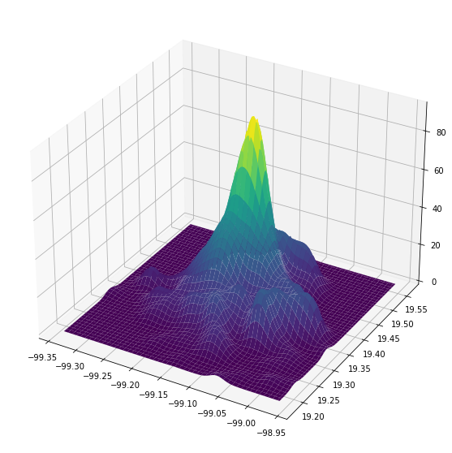
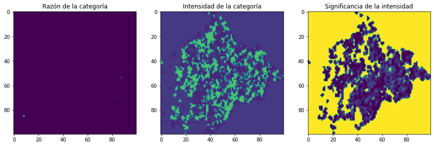
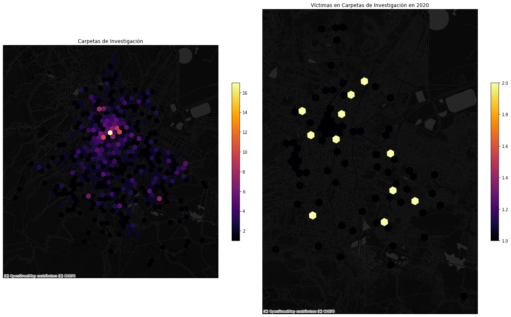

# criminologia_cdmx
> Herramientas para el análisis espacial de la delincuencia en la CDMX.


## Instalación

La forma más sencilla de instalarlo es creando un environment de conda que tenga geopandas instalado y después usar `pip` para instalar la librería dese el repositorio:


````bash
conda create -n criminologia python=3.7
conda install -c conda-forge geopandas
pip install git+https://github.com/CentroGeo/criminologia_cdmx
````

Por lo pronto, como el repositorio es privado Git va a pedir usuario y contraseña de GitHub.

Alternativamente, si tienes el repositorio clonado en la computadora:

````bash
conda create -n criminologia python=3.7
conda install -c conda-forge geopandas
pip install git+file///ruta/a/criminologia_cdmx
````

## Uso

## ETL
````Python
from criminologia_cdmx.etl import *
````

### Bajar datos abiertos

Podemos bajar dos fuentes de datos: [carpetas de investigación](https://datos.cdmx.gob.mx/dataset/carpetas-de-investigacion-fgj-de-la-ciudad-de-mexico) y [víctimas en carpetas de investigación](https://datos.cdmx.gob.mx/dataset/victimas-en-carpetas-de-investigacion-fgj/resource/d543a7b1-f8cb-439f-8a5c-e56c5479eeb5).

Hay dos formas de bajar los datos abiertos, la primera es usando el api que baja las primeras `limit` carpetas/víctimas de la base abierta

```python
carpetas = get_carpetas_from_api(limit=100)
carpetas.head()
```


<div>
<style scoped>
    .dataframe tbody tr th:only-of-type {
        vertical-align: middle;
    }

    .dataframe tbody tr th {
        vertical-align: top;
    }

    .dataframe thead th {
        text-align: right;
    }
</style>
<table border="1" class="dataframe">
  <thead>
    <tr style="text-align: right;">
      <th></th>
      <th>_id</th>
      <th>ao_hechos</th>
      <th>mes_hechos</th>
      <th>fecha_hechos</th>
      <th>ao_inicio</th>
      <th>mes_inicio</th>
      <th>fecha_inicio</th>
      <th>delito</th>
      <th>fiscalia</th>
      <th>agencia</th>
      <th>...</th>
      <th>categoria_delito</th>
      <th>calle_hechos</th>
      <th>calle_hechos2</th>
      <th>colonia_hechos</th>
      <th>alcaldia_hechos</th>
      <th>competencia</th>
      <th>longitud</th>
      <th>latitud</th>
      <th>tempo</th>
      <th>geometry</th>
    </tr>
  </thead>
  <tbody>
    <tr>
      <th>0</th>
      <td>751816</td>
      <td>2019</td>
      <td>Octubre</td>
      <td>2019-10-07 14:00:00</td>
      <td>2019</td>
      <td>Octubre</td>
      <td>2019-10-07T21:45:16</td>
      <td>PRODUCCIÓN, IMPRESIÓN, ENAJENACIÓN, DISTRIBUCI...</td>
      <td>INVESTIGACIÓN EN COYOACÁN</td>
      <td>COY-1</td>
      <td>...</td>
      <td>DELITO DE BAJO IMPACTO</td>
      <td>MIGUEL ANGEL DE QUEVEDO</td>
      <td>NaN</td>
      <td>ROMERO DE TERREROS</td>
      <td>COYOACAN</td>
      <td>NaN</td>
      <td>-99.17525</td>
      <td>19.34586</td>
      <td>NaN</td>
      <td>POINT (-99.17525 19.34586)</td>
    </tr>
    <tr>
      <th>1</th>
      <td>751817</td>
      <td>2019</td>
      <td>Octubre</td>
      <td>2019-10-07 14:00:00</td>
      <td>2019</td>
      <td>Octubre</td>
      <td>2019-10-07T21:46:30</td>
      <td>DAÑO EN PROPIEDAD AJENA CULPOSA POR TRÁNSITO V...</td>
      <td>INVESTIGACIÓN EN ÁLVARO OBREGÓN</td>
      <td>AO-4</td>
      <td>...</td>
      <td>DELITO DE BAJO IMPACTO</td>
      <td>AVENIDA PERIFERICO SUR</td>
      <td>CALZADA LAS AGUILAS</td>
      <td>LOS ALPES</td>
      <td>ALVARO OBREGON</td>
      <td>NaN</td>
      <td>-99.19513</td>
      <td>19.35819</td>
      <td>NaN</td>
      <td>POINT (-99.19513 19.35819)</td>
    </tr>
    <tr>
      <th>2</th>
      <td>751818</td>
      <td>2019</td>
      <td>Octubre</td>
      <td>2019-10-06 23:30:00</td>
      <td>2019</td>
      <td>Octubre</td>
      <td>2019-10-07T21:49:20</td>
      <td>ROBO A TRANSEUNTE CONDUCTOR DE TAXI PUBLICO Y ...</td>
      <td>INVESTIGACIÓN EN IZTAPALAPA</td>
      <td>IZP-6</td>
      <td>...</td>
      <td>DELITO DE BAJO IMPACTO</td>
      <td>AV. TELECOMUNICACIONES</td>
      <td>AV. GENERAL ANTONIO LEON LOYOLA (AMBAS SON PAR...</td>
      <td>UNIDAD EJÉRCITO CONSTITUCIONALISTA</td>
      <td>IZTAPALAPA</td>
      <td>NaN</td>
      <td>-99.04765</td>
      <td>19.38716</td>
      <td>NaN</td>
      <td>POINT (-99.04765 19.38716)</td>
    </tr>
    <tr>
      <th>3</th>
      <td>751819</td>
      <td>2019</td>
      <td>Septiembre</td>
      <td>2019-09-14 12:00:00</td>
      <td>2019</td>
      <td>Octubre</td>
      <td>2019-10-07T21:57:48</td>
      <td>FRAUDE</td>
      <td>INVESTIGACIÓN EN BENITO JUÁREZ</td>
      <td>BJ-3</td>
      <td>...</td>
      <td>DELITO DE BAJO IMPACTO</td>
      <td>EUGENIA</td>
      <td>NaN</td>
      <td>NARVARTE</td>
      <td>BENITO JUAREZ</td>
      <td>NaN</td>
      <td>-99.16102</td>
      <td>19.38601</td>
      <td>NaN</td>
      <td>POINT (-99.16102 19.38601)</td>
    </tr>
    <tr>
      <th>4</th>
      <td>751820</td>
      <td>2019</td>
      <td>Agosto</td>
      <td>2019-08-13 13:00:00</td>
      <td>2019</td>
      <td>Octubre</td>
      <td>2019-10-07T21:59:40</td>
      <td>VIOLENCIA FAMILIAR</td>
      <td>JUZGADOS FAMILIARES</td>
      <td>CJM-TLP</td>
      <td>...</td>
      <td>DELITO DE BAJO IMPACTO</td>
      <td>AVENIDA GUSTAVO DIAZ ORDAZ</td>
      <td>NaN</td>
      <td>AMPLIACIÓN JALALPA</td>
      <td>ALVARO OBREGON</td>
      <td>NaN</td>
      <td>-99.23382</td>
      <td>19.37586</td>
      <td>NaN</td>
      <td>POINT (-99.23382 19.37586)</td>
    </tr>
  </tbody>
</table>
<p>5 rows × 21 columns</p>
</div>


```python
victimas = get_victimas_from_api(limit=100)
victimas.head()
```


<div>
<style scoped>
    .dataframe tbody tr th:only-of-type {
        vertical-align: middle;
    }

    .dataframe tbody tr th {
        vertical-align: top;
    }

    .dataframe thead th {
        text-align: right;
    }
</style>
<table border="1" class="dataframe">
  <thead>
    <tr style="text-align: right;">
      <th></th>
      <th>_id</th>
      <th>idCarpeta</th>
      <th>Ano_inicio</th>
      <th>Mes_inicio</th>
      <th>FechaInicio</th>
      <th>delito</th>
      <th>categoria</th>
      <th>Sexo</th>
      <th>Edad</th>
      <th>TipoPersona</th>
      <th>...</th>
      <th>fecha_hechos</th>
      <th>HoraHecho</th>
      <th>HoraInicio</th>
      <th>AlcaldiaHechos</th>
      <th>ColoniaHechos</th>
      <th>Calle_hechos</th>
      <th>Calle_hechos2</th>
      <th>latitud</th>
      <th>longitud</th>
      <th>geometry</th>
    </tr>
  </thead>
  <tbody>
    <tr>
      <th>0</th>
      <td>595358</td>
      <td>8960172</td>
      <td>2021</td>
      <td>Junio</td>
      <td>2021-06-26T00:00:00</td>
      <td>ROBO DE VEHICULO DE SERVICIO PARTICULAR CON VI...</td>
      <td>ROBO DE VEHÍCULO CON Y SIN VIOLENCIA</td>
      <td>Masculino</td>
      <td>25</td>
      <td>FISICA</td>
      <td>...</td>
      <td>2021-06-26</td>
      <td>19:10:00</td>
      <td>22:17:00</td>
      <td>ALVARO OBREGON</td>
      <td>PUERTA GRANDE</td>
      <td>AVENIDA CENTENARIO   CASI ESQUINA CON LA CALLE...</td>
      <td>NaN</td>
      <td>19.3571148543388</td>
      <td>-99.2289503701792</td>
      <td>POINT (-99.22895 19.35711)</td>
    </tr>
    <tr>
      <th>1</th>
      <td>595359</td>
      <td>8960173</td>
      <td>2021</td>
      <td>Junio</td>
      <td>2021-06-26T00:00:00</td>
      <td>ROBO A TRANSPORTISTA Y VEHICULO PESADO CON VIO...</td>
      <td>ROBO A TRANSPORTISTA CON Y SIN VIOLENCIA</td>
      <td>NaN</td>
      <td>NaN</td>
      <td>MORAL</td>
      <td>...</td>
      <td>2021-06-25</td>
      <td>23:30:00</td>
      <td>22:17:00</td>
      <td>AZCAPOTZALCO</td>
      <td>INDUSTRIAL VALLEJO</td>
      <td>AVENIDA CEYLAN</td>
      <td>ENTRE CERRADA CEYLAN</td>
      <td>19.4938324187342</td>
      <td>-99.1699397596072</td>
      <td>POINT (-99.16994 19.49383)</td>
    </tr>
    <tr>
      <th>2</th>
      <td>595360</td>
      <td>8960173</td>
      <td>2021</td>
      <td>Junio</td>
      <td>2021-06-26T00:00:00</td>
      <td>ROBO A TRANSPORTISTA Y VEHICULO PESADO CON VIO...</td>
      <td>ROBO A TRANSPORTISTA CON Y SIN VIOLENCIA</td>
      <td>NaN</td>
      <td>NaN</td>
      <td>MORAL</td>
      <td>...</td>
      <td>2021-06-25</td>
      <td>23:30:00</td>
      <td>22:17:00</td>
      <td>AZCAPOTZALCO</td>
      <td>INDUSTRIAL VALLEJO</td>
      <td>AVENIDA CEYLAN</td>
      <td>ENTRE CERRADA CEYLAN</td>
      <td>19.4938324187342</td>
      <td>-99.1699397596072</td>
      <td>POINT (-99.16994 19.49383)</td>
    </tr>
    <tr>
      <th>3</th>
      <td>595361</td>
      <td>8960175</td>
      <td>2021</td>
      <td>Junio</td>
      <td>2021-06-26T00:00:00</td>
      <td>ROBO A NEGOCIO SIN VIOLENCIA POR FARDEROS (TIE...</td>
      <td>DELITO DE BAJO IMPACTO</td>
      <td>NaN</td>
      <td>NaN</td>
      <td>MORAL</td>
      <td>...</td>
      <td>2021-06-26</td>
      <td>21:20:00</td>
      <td>22:21:00</td>
      <td>IZTAPALAPA</td>
      <td>GUADALUPE DEL MORAL</td>
      <td>AVENIDA JAVIER ROJO GOMEZ</td>
      <td>NaN</td>
      <td>19.3681183577951</td>
      <td>-99.0814492098267</td>
      <td>POINT (-99.08145 19.36812)</td>
    </tr>
    <tr>
      <th>4</th>
      <td>595362</td>
      <td>8960176</td>
      <td>2021</td>
      <td>Junio</td>
      <td>2021-06-26T00:00:00</td>
      <td>FRAUDE</td>
      <td>DELITO DE BAJO IMPACTO</td>
      <td>Masculino</td>
      <td>37</td>
      <td>FISICA</td>
      <td>...</td>
      <td>2021-06-26</td>
      <td>08:27:00</td>
      <td>22:31:00</td>
      <td>BENITO JUAREZ</td>
      <td>NAPOLES</td>
      <td>ARIZONA</td>
      <td>PENSILVANIA</td>
      <td>19.3927810885787</td>
      <td>-99.1806440001974</td>
      <td>POINT (-99.18064 19.39278)</td>
    </tr>
  </tbody>
</table>
<p>5 rows × 24 columns</p>
</div>


La segunda es bajar el histórico completo:

````Python
carpetas_todas = get_historico_carpetas()
victimas_todas = get_historico_victimas()
````

También es posible procesar los datos a partir de un archivo guardado en la computadora, ya sea obtenido de la página de datos abiertos o guardado con las funciones `get_historico_carpetas`/`get_historico_victimas`.

````Python
carpetas = get_carpetas_desde_archivo("path-a-los-datos")
victimas_todas = get_victimas_desde_archivo("path-a-los-datos")
````

### Agregar identificadores espaciales (carpetas o victimas)

Para agregar los identificadores de colonia y cuadrante:

```python
carpetas = agrega_ids_espaciales(carpetas)
carpetas.head()
```


<div>
<style scoped>
    .dataframe tbody tr th:only-of-type {
        vertical-align: middle;
    }

    .dataframe tbody tr th {
        vertical-align: top;
    }

    .dataframe thead th {
        text-align: right;
    }
</style>
<table border="1" class="dataframe">
  <thead>
    <tr style="text-align: right;">
      <th></th>
      <th>_id</th>
      <th>ao_hechos</th>
      <th>mes_hechos</th>
      <th>fecha_hechos</th>
      <th>ao_inicio</th>
      <th>mes_inicio</th>
      <th>fecha_inicio</th>
      <th>delito</th>
      <th>fiscalia</th>
      <th>agencia</th>
      <th>...</th>
      <th>alcaldia_hechos</th>
      <th>competencia</th>
      <th>longitud</th>
      <th>latitud</th>
      <th>tempo</th>
      <th>geometry</th>
      <th>colonia_cve</th>
      <th>colonia_nombre</th>
      <th>municipio_cvegeo</th>
      <th>cuadrante_id</th>
    </tr>
  </thead>
  <tbody>
    <tr>
      <th>0</th>
      <td>751816</td>
      <td>2019</td>
      <td>Octubre</td>
      <td>2019-10-07 14:00:00</td>
      <td>2019</td>
      <td>Octubre</td>
      <td>2019-10-07T21:45:16</td>
      <td>PRODUCCIÓN, IMPRESIÓN, ENAJENACIÓN, DISTRIBUCI...</td>
      <td>INVESTIGACIÓN EN COYOACÁN</td>
      <td>COY-1</td>
      <td>...</td>
      <td>COYOACAN</td>
      <td>NaN</td>
      <td>-99.17525</td>
      <td>19.34586</td>
      <td>NaN</td>
      <td>POINT (-99.17525 19.34586)</td>
      <td>1149</td>
      <td>ROMERO DE TERREROS (FRACC)</td>
      <td>09003</td>
      <td>023</td>
    </tr>
    <tr>
      <th>1</th>
      <td>751817</td>
      <td>2019</td>
      <td>Octubre</td>
      <td>2019-10-07 14:00:00</td>
      <td>2019</td>
      <td>Octubre</td>
      <td>2019-10-07T21:46:30</td>
      <td>DAÑO EN PROPIEDAD AJENA CULPOSA POR TRÁNSITO V...</td>
      <td>INVESTIGACIÓN EN ÁLVARO OBREGÓN</td>
      <td>AO-4</td>
      <td>...</td>
      <td>ALVARO OBREGON</td>
      <td>NaN</td>
      <td>-99.19513</td>
      <td>19.35819</td>
      <td>NaN</td>
      <td>POINT (-99.19513 19.35819)</td>
      <td>264</td>
      <td>ALPES</td>
      <td>09010</td>
      <td>015</td>
    </tr>
    <tr>
      <th>2</th>
      <td>751818</td>
      <td>2019</td>
      <td>Octubre</td>
      <td>2019-10-06 23:30:00</td>
      <td>2019</td>
      <td>Octubre</td>
      <td>2019-10-07T21:49:20</td>
      <td>ROBO A TRANSEUNTE CONDUCTOR DE TAXI PUBLICO Y ...</td>
      <td>INVESTIGACIÓN EN IZTAPALAPA</td>
      <td>IZP-6</td>
      <td>...</td>
      <td>IZTAPALAPA</td>
      <td>NaN</td>
      <td>-99.04765</td>
      <td>19.38716</td>
      <td>NaN</td>
      <td>POINT (-99.04765 19.38716)</td>
      <td>1269</td>
      <td>EJTO CONSTITUCIONALISTA, SUPERMANZANA I ( U HAB)</td>
      <td>09007</td>
      <td>0119</td>
    </tr>
    <tr>
      <th>3</th>
      <td>751819</td>
      <td>2019</td>
      <td>Septiembre</td>
      <td>2019-09-14 12:00:00</td>
      <td>2019</td>
      <td>Octubre</td>
      <td>2019-10-07T21:57:48</td>
      <td>FRAUDE</td>
      <td>INVESTIGACIÓN EN BENITO JUÁREZ</td>
      <td>BJ-3</td>
      <td>...</td>
      <td>BENITO JUAREZ</td>
      <td>NaN</td>
      <td>-99.16102</td>
      <td>19.38601</td>
      <td>NaN</td>
      <td>POINT (-99.16102 19.38601)</td>
      <td>936</td>
      <td>NARVARTE V</td>
      <td>09014</td>
      <td>0111</td>
    </tr>
    <tr>
      <th>4</th>
      <td>751820</td>
      <td>2019</td>
      <td>Agosto</td>
      <td>2019-08-13 13:00:00</td>
      <td>2019</td>
      <td>Octubre</td>
      <td>2019-10-07T21:59:40</td>
      <td>VIOLENCIA FAMILIAR</td>
      <td>JUZGADOS FAMILIARES</td>
      <td>CJM-TLP</td>
      <td>...</td>
      <td>ALVARO OBREGON</td>
      <td>NaN</td>
      <td>-99.23382</td>
      <td>19.37586</td>
      <td>NaN</td>
      <td>POINT (-99.23382 19.37586)</td>
      <td>1051</td>
      <td>JALALPA TEPITO</td>
      <td>09010</td>
      <td>013</td>
    </tr>
  </tbody>
</table>
<p>5 rows × 25 columns</p>
</div>


```python
victimas = agrega_ids_espaciales(victimas)
victimas.head()
```


<div>
<style scoped>
    .dataframe tbody tr th:only-of-type {
        vertical-align: middle;
    }

    .dataframe tbody tr th {
        vertical-align: top;
    }

    .dataframe thead th {
        text-align: right;
    }
</style>
<table border="1" class="dataframe">
  <thead>
    <tr style="text-align: right;">
      <th></th>
      <th>_id</th>
      <th>idCarpeta</th>
      <th>Ano_inicio</th>
      <th>Mes_inicio</th>
      <th>FechaInicio</th>
      <th>delito</th>
      <th>categoria</th>
      <th>Sexo</th>
      <th>Edad</th>
      <th>TipoPersona</th>
      <th>...</th>
      <th>ColoniaHechos</th>
      <th>Calle_hechos</th>
      <th>Calle_hechos2</th>
      <th>latitud</th>
      <th>longitud</th>
      <th>geometry</th>
      <th>colonia_cve</th>
      <th>colonia_nombre</th>
      <th>municipio_cvegeo</th>
      <th>cuadrante_id</th>
    </tr>
  </thead>
  <tbody>
    <tr>
      <th>0</th>
      <td>595358</td>
      <td>8960172</td>
      <td>2021</td>
      <td>Junio</td>
      <td>2021-06-26T00:00:00</td>
      <td>ROBO DE VEHICULO DE SERVICIO PARTICULAR CON VI...</td>
      <td>ROBO DE VEHÍCULO CON Y SIN VIOLENCIA</td>
      <td>Masculino</td>
      <td>25</td>
      <td>FISICA</td>
      <td>...</td>
      <td>PUERTA GRANDE</td>
      <td>AVENIDA CENTENARIO   CASI ESQUINA CON LA CALLE...</td>
      <td>NaN</td>
      <td>19.3571148543388</td>
      <td>-99.2289503701792</td>
      <td>POINT (-99.22895 19.35711)</td>
      <td>1121</td>
      <td>LOMAS DE PUERTA GRANDE</td>
      <td>09010</td>
      <td>017</td>
    </tr>
    <tr>
      <th>1</th>
      <td>595359</td>
      <td>8960173</td>
      <td>2021</td>
      <td>Junio</td>
      <td>2021-06-26T00:00:00</td>
      <td>ROBO A TRANSPORTISTA Y VEHICULO PESADO CON VIO...</td>
      <td>ROBO A TRANSPORTISTA CON Y SIN VIOLENCIA</td>
      <td>NaN</td>
      <td>NaN</td>
      <td>MORAL</td>
      <td>...</td>
      <td>INDUSTRIAL VALLEJO</td>
      <td>AVENIDA CEYLAN</td>
      <td>ENTRE CERRADA CEYLAN</td>
      <td>19.4938324187342</td>
      <td>-99.1699397596072</td>
      <td>POINT (-99.16994 19.49383)</td>
      <td>80</td>
      <td>INDUSTRIAL VALLEJO (U HAB)</td>
      <td>09002</td>
      <td>022</td>
    </tr>
    <tr>
      <th>2</th>
      <td>595360</td>
      <td>8960173</td>
      <td>2021</td>
      <td>Junio</td>
      <td>2021-06-26T00:00:00</td>
      <td>ROBO A TRANSPORTISTA Y VEHICULO PESADO CON VIO...</td>
      <td>ROBO A TRANSPORTISTA CON Y SIN VIOLENCIA</td>
      <td>NaN</td>
      <td>NaN</td>
      <td>MORAL</td>
      <td>...</td>
      <td>INDUSTRIAL VALLEJO</td>
      <td>AVENIDA CEYLAN</td>
      <td>ENTRE CERRADA CEYLAN</td>
      <td>19.4938324187342</td>
      <td>-99.1699397596072</td>
      <td>POINT (-99.16994 19.49383)</td>
      <td>80</td>
      <td>INDUSTRIAL VALLEJO (U HAB)</td>
      <td>09002</td>
      <td>022</td>
    </tr>
    <tr>
      <th>3</th>
      <td>595361</td>
      <td>8960175</td>
      <td>2021</td>
      <td>Junio</td>
      <td>2021-06-26T00:00:00</td>
      <td>ROBO A NEGOCIO SIN VIOLENCIA POR FARDEROS (TIE...</td>
      <td>DELITO DE BAJO IMPACTO</td>
      <td>NaN</td>
      <td>NaN</td>
      <td>MORAL</td>
      <td>...</td>
      <td>GUADALUPE DEL MORAL</td>
      <td>AVENIDA JAVIER ROJO GOMEZ</td>
      <td>NaN</td>
      <td>19.3681183577951</td>
      <td>-99.0814492098267</td>
      <td>POINT (-99.08145 19.36812)</td>
      <td>1351</td>
      <td>GUADALUPE DEL MORAL</td>
      <td>09007</td>
      <td>0120</td>
    </tr>
    <tr>
      <th>4</th>
      <td>595362</td>
      <td>8960176</td>
      <td>2021</td>
      <td>Junio</td>
      <td>2021-06-26T00:00:00</td>
      <td>FRAUDE</td>
      <td>DELITO DE BAJO IMPACTO</td>
      <td>Masculino</td>
      <td>37</td>
      <td>FISICA</td>
      <td>...</td>
      <td>NAPOLES</td>
      <td>ARIZONA</td>
      <td>PENSILVANIA</td>
      <td>19.3927810885787</td>
      <td>-99.1806440001974</td>
      <td>POINT (-99.18064 19.39278)</td>
      <td>242</td>
      <td>NAPOLES</td>
      <td>09014</td>
      <td>011</td>
    </tr>
  </tbody>
</table>
<p>5 rows × 28 columns</p>
</div>


### Agregar categorías de usuario

Para clasificar las carpetas de investigación de acuerdo a una categorización definida por el usuario necesitamos un archivo que relacione la columna delitos de la base de carpetas con las categorías definidas por el usuario

```python
categorias = pd.read_csv("datos/categorias_carpetas.csv")
categorias
```


<div>
<style scoped>
    .dataframe tbody tr th:only-of-type {
        vertical-align: middle;
    }

    .dataframe tbody tr th {
        vertical-align: top;
    }

    .dataframe thead th {
        text-align: right;
    }
</style>
<table border="1" class="dataframe">
  <thead>
    <tr style="text-align: right;">
      <th></th>
      <th>incidente</th>
      <th>categoria</th>
    </tr>
  </thead>
  <tbody>
    <tr>
      <th>0</th>
      <td>HOMICIDIO POR AHORCAMIENTO</td>
      <td>Homicidios dolosos</td>
    </tr>
    <tr>
      <th>1</th>
      <td>HOMICIDIO POR ARMA BLANCA</td>
      <td>Homicidios dolosos</td>
    </tr>
    <tr>
      <th>2</th>
      <td>HOMICIDIO POR ARMA DE FUEGO</td>
      <td>Homicidios dolosos</td>
    </tr>
    <tr>
      <th>3</th>
      <td>HOMICIDIO POR GOLPES</td>
      <td>Homicidios dolosos</td>
    </tr>
    <tr>
      <th>4</th>
      <td>HOMICIDIOS INTENCIONALES (OTROS)</td>
      <td>Homicidios dolosos</td>
    </tr>
    <tr>
      <th>...</th>
      <td>...</td>
      <td>...</td>
    </tr>
    <tr>
      <th>73</th>
      <td>ROBO DE VEHICULO DE SERVICIO PÚBLICO CON VIOLE...</td>
      <td>Robo de/en vehículo</td>
    </tr>
    <tr>
      <th>74</th>
      <td>ROBO DE VEHICULO DE SERVICIO PÚBLICO SIN VIOLE...</td>
      <td>Robo de/en vehículo</td>
    </tr>
    <tr>
      <th>75</th>
      <td>ROBO DE VEHICULO ELECTRICO MOTOPATIN</td>
      <td>Robo de/en vehículo</td>
    </tr>
    <tr>
      <th>76</th>
      <td>OBO DE VEHICULO EN PENSION, TALLER Y AGENCIAS C/V</td>
      <td>Robo de/en vehículo</td>
    </tr>
    <tr>
      <th>77</th>
      <td>ROBO DE VEHICULO EN PENSION, TALLER Y AGENCIAS...</td>
      <td>Robo de/en vehículo</td>
    </tr>
  </tbody>
</table>
<p>78 rows × 2 columns</p>
</div>


Entonces podemos agregar las categorías a nuestra base

```python
carpetas = agregar_categorias_carpetas(carpetas)
carpetas[['delito', 'categoria']]
```


<div>
<style scoped>
    .dataframe tbody tr th:only-of-type {
        vertical-align: middle;
    }

    .dataframe tbody tr th {
        vertical-align: top;
    }

    .dataframe thead th {
        text-align: right;
    }
</style>
<table border="1" class="dataframe">
  <thead>
    <tr style="text-align: right;">
      <th></th>
      <th>delito</th>
      <th>categoria</th>
    </tr>
  </thead>
  <tbody>
    <tr>
      <th>0</th>
      <td>DAÑO EN PROPIEDAD AJENA INTENCIONAL</td>
      <td>NaN</td>
    </tr>
    <tr>
      <th>1</th>
      <td>ROBO DE VEHICULO DE SERVICIO PARTICULAR CON VI...</td>
      <td>Robo de/en vehículo</td>
    </tr>
    <tr>
      <th>2</th>
      <td>NARCOMENUDEO POSESION SIMPLE</td>
      <td>NaN</td>
    </tr>
    <tr>
      <th>3</th>
      <td>ROBO A TRANSEUNTE EN VIA PUBLICA CON VIOLENCIA</td>
      <td>Robo a transeúnte</td>
    </tr>
    <tr>
      <th>4</th>
      <td>DENUNCIA DE HECHOS</td>
      <td>NaN</td>
    </tr>
    <tr>
      <th>...</th>
      <td>...</td>
      <td>...</td>
    </tr>
    <tr>
      <th>1217266</th>
      <td>ABUSO DE AUTORIDAD Y USO ILEGAL DE LA FUERZA P...</td>
      <td>NaN</td>
    </tr>
    <tr>
      <th>1217267</th>
      <td>ROBO A NEGOCIO CON VIOLENCIA</td>
      <td>Robo a negocio</td>
    </tr>
    <tr>
      <th>1217268</th>
      <td>DAÑO EN PROPIEDAD AJENA INTENCIONAL A BIENES I...</td>
      <td>NaN</td>
    </tr>
    <tr>
      <th>1217269</th>
      <td>ALLANAMIENTO DE MORADA, DESPACHO, OFICINA O ES...</td>
      <td>NaN</td>
    </tr>
    <tr>
      <th>1217270</th>
      <td>ROBO A TRANSEUNTE EN VIA PUBLICA CON VIOLENCIA</td>
      <td>Robo a transeúnte</td>
    </tr>
  </tbody>
</table>
<p>1217271 rows × 2 columns</p>
</div>


Algo similar se puede hacer para los datos de Víctimas, en este caso el archivo de categorías es un poco diferente

```python
categorias_victimas = pd.read_csv("datos/categorias_victimas.csv")
categorias_victimas
```


<div>
<style scoped>
    .dataframe tbody tr th:only-of-type {
        vertical-align: middle;
    }

    .dataframe tbody tr th {
        vertical-align: top;
    }

    .dataframe thead th {
        text-align: right;
    }
</style>
<table border="1" class="dataframe">
  <thead>
    <tr style="text-align: right;">
      <th></th>
      <th>Delito</th>
      <th>Categoria</th>
      <th>Cantidad</th>
      <th>Nivel 1</th>
      <th>Nivel 2</th>
      <th>Nivel 3</th>
    </tr>
  </thead>
  <tbody>
    <tr>
      <th>0</th>
      <td>ABORTO</td>
      <td>DELITO DE BAJO IMPACTO</td>
      <td>168</td>
      <td>NaN</td>
      <td>NaN</td>
      <td>NaN</td>
    </tr>
    <tr>
      <th>1</th>
      <td>ABUSO DE AUTORIDAD Y USO ILEGAL DE LA FUERZA P...</td>
      <td>DELITO DE BAJO IMPACTO</td>
      <td>5924</td>
      <td>NaN</td>
      <td>NaN</td>
      <td>NaN</td>
    </tr>
    <tr>
      <th>2</th>
      <td>ABUSO DE CONFIANZA</td>
      <td>DELITO DE BAJO IMPACTO</td>
      <td>12050</td>
      <td>Abuso de Confianza</td>
      <td>NaN</td>
      <td>NaN</td>
    </tr>
    <tr>
      <th>3</th>
      <td>ABUSO SEXUAL</td>
      <td>DELITO DE BAJO IMPACTO</td>
      <td>10238</td>
      <td>Abuso Sexual</td>
      <td>NaN</td>
      <td>NaN</td>
    </tr>
    <tr>
      <th>4</th>
      <td>ACOSO SEXUAL</td>
      <td>DELITO DE BAJO IMPACTO</td>
      <td>2986</td>
      <td>NaN</td>
      <td>NaN</td>
      <td>NaN</td>
    </tr>
    <tr>
      <th>...</th>
      <td>...</td>
      <td>...</td>
      <td>...</td>
      <td>...</td>
      <td>...</td>
      <td>...</td>
    </tr>
    <tr>
      <th>295</th>
      <td>VIOLACION TUMULTUARIA</td>
      <td>VIOLACIÓN</td>
      <td>74</td>
      <td>NaN</td>
      <td>NaN</td>
      <td>NaN</td>
    </tr>
    <tr>
      <th>296</th>
      <td>VIOLACION TUMULTUARIA EQUIPARADA</td>
      <td>VIOLACIÓN</td>
      <td>4</td>
      <td>NaN</td>
      <td>NaN</td>
      <td>NaN</td>
    </tr>
    <tr>
      <th>297</th>
      <td>VIOLACION TUMULTUARIA EQUIPARADA POR CONOCIDO</td>
      <td>VIOLACIÓN</td>
      <td>2</td>
      <td>NaN</td>
      <td>NaN</td>
      <td>NaN</td>
    </tr>
    <tr>
      <th>298</th>
      <td>VIOLACION Y ROBO DE VEHICULO</td>
      <td>VIOLACIÓN</td>
      <td>1</td>
      <td>NaN</td>
      <td>NaN</td>
      <td>NaN</td>
    </tr>
    <tr>
      <th>299</th>
      <td>VIOLENCIA FAMILIAR</td>
      <td>DELITO DE BAJO IMPACTO</td>
      <td>94592</td>
      <td>Violencia Familiar</td>
      <td>NaN</td>
      <td>NaN</td>
    </tr>
  </tbody>
</table>
<p>300 rows × 6 columns</p>
</div>


Las columnas importantes son `Nivel 1` y `Nivel 2` (podría haber más niveles), esas definen las categorías que se van a asignar a cada fila que se una a los datos de víctimas via la columna `Delito`

```python
victimas = agregar_categorias_victimas(victimas)
victimas[['Delito', 'Nivel 1', 'Nivel 2', 'Nivel 3']]
```


<div>
<style scoped>
    .dataframe tbody tr th:only-of-type {
        vertical-align: middle;
    }

    .dataframe tbody tr th {
        vertical-align: top;
    }

    .dataframe thead th {
        text-align: right;
    }
</style>
<table border="1" class="dataframe">
  <thead>
    <tr style="text-align: right;">
      <th></th>
      <th>Delito</th>
      <th>Nivel 1</th>
      <th>Nivel 2</th>
      <th>Nivel 3</th>
    </tr>
  </thead>
  <tbody>
    <tr>
      <th>0</th>
      <td>ROBO DE VEHICULO DE SERVICIO PARTICULAR CON VI...</td>
      <td>Robo de Vehículo de Servicio Particular</td>
      <td>Con Violencia</td>
      <td>NaN</td>
    </tr>
    <tr>
      <th>1</th>
      <td>ROBO A TRANSPORTISTA Y VEHICULO PESADO CON VIO...</td>
      <td>NaN</td>
      <td>NaN</td>
      <td>NaN</td>
    </tr>
    <tr>
      <th>2</th>
      <td>ROBO A TRANSPORTISTA Y VEHICULO PESADO CON VIO...</td>
      <td>NaN</td>
      <td>NaN</td>
      <td>NaN</td>
    </tr>
    <tr>
      <th>3</th>
      <td>ROBO A NEGOCIO SIN VIOLENCIA POR FARDEROS (TIE...</td>
      <td>Robo a Negocio y Tiendas de Autoservicio</td>
      <td>Sin Violencia</td>
      <td>NaN</td>
    </tr>
    <tr>
      <th>4</th>
      <td>FRAUDE</td>
      <td>Fraude</td>
      <td>NaN</td>
      <td>NaN</td>
    </tr>
    <tr>
      <th>...</th>
      <td>...</td>
      <td>...</td>
      <td>...</td>
      <td>...</td>
    </tr>
    <tr>
      <th>90</th>
      <td>NARCOMENUDEO POSESION SIMPLE</td>
      <td>Narcomenudeo</td>
      <td>Posesión Simple</td>
      <td>NaN</td>
    </tr>
    <tr>
      <th>91</th>
      <td>DAÑO EN PROPIEDAD AJENA CULPOSA POR TRÁNSITO V...</td>
      <td>NaN</td>
      <td>NaN</td>
      <td>NaN</td>
    </tr>
    <tr>
      <th>92</th>
      <td>ROBO A TRANSEUNTE EN NEGOCIO CON VIOLENCIA</td>
      <td>NaN</td>
      <td>NaN</td>
      <td>NaN</td>
    </tr>
    <tr>
      <th>93</th>
      <td>LESIONES CULPOSAS POR TRANSITO VEHICULAR EN CO...</td>
      <td>NaN</td>
      <td>NaN</td>
      <td>NaN</td>
    </tr>
    <tr>
      <th>94</th>
      <td>DAÑO EN PROPIEDAD AJENA CULPOSA POR TRÁNSITO V...</td>
      <td>NaN</td>
      <td>NaN</td>
      <td>NaN</td>
    </tr>
  </tbody>
</table>
<p>95 rows × 4 columns</p>
</div>


### Exportar datos para el visualizador

```python
exporta_datos_visualizador(carpetas, "datos/salidas/carpetas.csv", tipo='carpetas')
exporta_datos_visualizador(victimas, "datos/salidas/victimas.csv", tipo='victimas')
```

### Serie de tiempo por categoría

````Python
serie = serie_de_tiempo_categoria(carpetas_todas, pd.to_datetime('01/01/2016'), 'Robo a pasajero')
````

### Serie de tiempo por geografía y categoría
````Python
serie = serie_tiempo_categorias_unidades(victimas, pd.to_datetime('01/01/2019'))
````

## Patrones espacio temporales

Este módulo tiene diferentes herramientas para explorar los patrones espacio-temporales de la actividad delictiva
````Python
from criminologia_cdmx.patrones_espacio_temporales import *
````

### Estimación de densidad de kernel
A partir de cualquier capa de incidentes se puede estimar el KDE utilizando validación cruzada para encontrar el mejor bandwidth

```python
carpetas = get_carpetas_from_api(1000)
x = carpetas.geometry.x.to_numpy()
y = carpetas.geometry.y.to_numpy()
params = {'bandwidth': np.linspace(0.001, 0.1, 100)}
bw = ajusta_bandwidth_kde(x, y, params)
xx, yy, zz = kde2D(x, y, bw, xbins=100j, ybins=100j)
fig = plt.figure(figsize=(10,10))
ax = plt.axes(projection='3d')
ax.plot_surface(xx, yy, zz,cmap='viridis', edgecolor='none')
```


    <mpl_toolkits.mplot3d.art3d.Poly3DCollection at 0x7f2122d15d00>





### Serie de tiempo de KDEs por categoría

Para una categoría determinada se obtiene la serie de tiempo de densidades de Kernel para un periodo arbitrario, utilizando la agregación temporal determinada por el usuario.

Para usar esta función no es necesario agregar los ids de unidades espaciales.

````Python

carpetas = get_carpetas_desde_archivo()
carpetas = agregar_categorias_carpetas(carpetas)
fechas = pd.date_range(start='1/1/2019', end='1/1/2021', freq='M').to_list()
xx, yy, kdes = serie_tiempo_kde_categoria(carpetas, 
                                          fechas, 
                                          ["Homicidios dolosos"], 
                                          "30 days")
````

Ya teniendo la serie de KDEs es relatívamente fácil obtener una animación de la evolución utilizando el siguiente código. Es necesario instalar la extensión [ipywidgets](https://ipywidgets.readthedocs.io/en/latest/):
````Python

import matplotlib.animation as animation
def data(t):
    d = kdes[t]
    ax.clear()
    surf = ax.plot_surface(XX, YY, d[2], cmap='viridis', edgecolor='none', 
                           antialiased=False)
    ax.set_zlim([0,50]) 


fig = plt.figure(figsize=(10,10))
ax = fig.gca(projection='3d')
surf = ax.plot_surface(xx, yy, kdes[0][2],cmap='viridis', edgecolor='none', antialiased=False)
ax.set_zlim(0, 50)
ani = animation.FuncAnimation(fig, data, len(kdes), interval=50, repeat=False )
plt.show()
````

### Mapas de intensidad relativa y significancia

Además de producir las superficies de probabilidad para cada categoría de delitos, es posible comparar dos categorías y estimar la significancia de las diferencias

```python
carpetas_todas = get_carpetas_desde_archivo('datos/descargas/carpetas_fiscalia.csv')
carpetas_todas = agregar_categorias_carpetas(carpetas_todas)
fechas = pd.date_range(start='1/1/2019', end='3/1/2019', freq='M').to_list()
razones, intensidades = serie_mapas_intensidad(carpetas_todas, 
                                               fechas,
                                               'Homicidios dolosos',
                                               "30 days", bw=0.001)
significancias = p_value_maps(razones)
fig, (ax1, ax2, ax3) = plt.subplots(1,3, figsize=(15,10))
ax1.imshow(razones[0])
ax1.set_title("Razón de la categoría")
ax2.imshow(intensidades[0])
ax2.set_title("Intensidad de la categoría")
ax3.imshow(significancias[0])
ax3.set_title("Significancia de la intensidad")
```


    Text(0.5, 1.0, 'Significancia de la intensidad')





### Agregar en hexágonos

Se puede agregar los datos de carpetas/victimas en hexágonos de Uber H3 usando la función `agrega_en_hexagonos` y pasándole los datos y el nivel de escala. Por ejemplo, para agregar los datos en el nivel 8

```python
carpetas_hex = agrega_en_hexagonos(carpetas, 8)
victimas_hex = agrega_en_hexagonos(victimas, 8)
fig, (ax0, ax1) = plt.subplots(1, 2, figsize=(18, 18))
ax0 = (carpetas_hex
       .to_crs(epsg=3857)
       .plot('incidentes', 
             ax=ax0, 
             legend=True,
             cmap='inferno',
             legend_kwds={'shrink': 0.3},))
ax0.set_title("Carpetas de Investigación")
ax0.set_axis_off()
ctx.add_basemap(ax0, source=ctx.providers.CartoDB.DarkMatterNoLabels)
ax1 = (victimas_hex
       .to_crs(epsg=3857)
       .plot('incidentes', 
             ax=ax1, 
             legend=True,
             cmap='inferno',
             legend_kwds={'shrink': 0.3}))
ax1.set_title("Víctimas en Carpetas de Investigación en 2020")
ax1.set_axis_off()
ctx.add_basemap(ax1, source=ctx.providers.CartoDB.DarkMatterNoLabels)
plt.tight_layout()
```





## Covariables

Este módulo contiene diferentes funciones y clases para construir covariables para el analisis de delitos.
````Python
from criminologia_cdmx. covariables import *
````
Antes de utilizar este módulo es necesario descargar los datos:

````Python
descarga_datos_covariables()
````

Después de descargar los datos es posible utilizar todas las funciones del módulo.

### Variables censales

El módulo contiene diferentes funciones para procesar las variables del censo, un flujo típico de trabajo consistiría en:

* Leer el censo a nivel manzana
* Agregar en colonias
* Calcular las tasas de las variables

```python
diccionario = get_diccionario_censo()
censo = get_variables_censo()
agregado = agrega_en_unidades(censo, diccionario, imputacion='random')
agregado = censo_a_tasas(agregado, diccionario)
agregado
```


<div>
<style scoped>
    .dataframe tbody tr th:only-of-type {
        vertical-align: middle;
    }

    .dataframe tbody tr th {
        vertical-align: top;
    }

    .dataframe thead th {
        text-align: right;
    }
</style>
<table border="1" class="dataframe">
  <thead>
    <tr style="text-align: right;">
      <th></th>
      <th>POBTOT</th>
      <th>POBFEM</th>
      <th>POBMAS</th>
      <th>P_0A2</th>
      <th>P_0A2_F</th>
      <th>P_0A2_M</th>
      <th>P_3YMAS</th>
      <th>P_3YMAS_F</th>
      <th>P_3YMAS_M</th>
      <th>P_5YMAS</th>
      <th>...</th>
      <th>VPH_INTER</th>
      <th>VPH_STVP</th>
      <th>VPH_SPMVPI</th>
      <th>VPH_CVJ</th>
      <th>VPH_SINRTV</th>
      <th>VPH_SINLTC</th>
      <th>VPH_SINCINT</th>
      <th>VPH_SINTIC</th>
      <th>OCUPVIVPAR</th>
      <th>PROM_OCUP_C</th>
    </tr>
    <tr>
      <th>colonia_cve</th>
      <th></th>
      <th></th>
      <th></th>
      <th></th>
      <th></th>
      <th></th>
      <th></th>
      <th></th>
      <th></th>
      <th></th>
      <th></th>
      <th></th>
      <th></th>
      <th></th>
      <th></th>
      <th></th>
      <th></th>
      <th></th>
      <th></th>
      <th></th>
      <th></th>
    </tr>
  </thead>
  <tbody>
    <tr>
      <th>1</th>
      <td>73.0</td>
      <td>1.191781</td>
      <td>1.164384</td>
      <td>1.534247</td>
      <td>1.095890</td>
      <td>1.068493</td>
      <td>0.876712</td>
      <td>1.123288</td>
      <td>1.150685</td>
      <td>1.082192</td>
      <td>...</td>
      <td>0.897727</td>
      <td>0.806818</td>
      <td>0.863636</td>
      <td>0.818182</td>
      <td>0.886364</td>
      <td>0.977273</td>
      <td>1.068182</td>
      <td>1.000000</td>
      <td>81.0</td>
      <td>0.162651</td>
    </tr>
    <tr>
      <th>2</th>
      <td>106.0</td>
      <td>1.037736</td>
      <td>1.084906</td>
      <td>1.047170</td>
      <td>0.943396</td>
      <td>0.783019</td>
      <td>0.952830</td>
      <td>0.981132</td>
      <td>0.943396</td>
      <td>0.915094</td>
      <td>...</td>
      <td>1.027027</td>
      <td>0.909910</td>
      <td>0.945946</td>
      <td>0.819820</td>
      <td>0.990991</td>
      <td>0.963964</td>
      <td>0.981982</td>
      <td>0.891892</td>
      <td>90.0</td>
      <td>0.149007</td>
    </tr>
    <tr>
      <th>3</th>
      <td>24.0</td>
      <td>0.916667</td>
      <td>0.708333</td>
      <td>0.708333</td>
      <td>0.916667</td>
      <td>0.958333</td>
      <td>0.875000</td>
      <td>0.958333</td>
      <td>1.041667</td>
      <td>0.875000</td>
      <td>...</td>
      <td>0.913043</td>
      <td>0.695652</td>
      <td>0.869565</td>
      <td>0.913043</td>
      <td>1.000000</td>
      <td>0.826087</td>
      <td>1.391304</td>
      <td>1.086957</td>
      <td>20.0</td>
      <td>0.152672</td>
    </tr>
    <tr>
      <th>4</th>
      <td>36.0</td>
      <td>1.138889</td>
      <td>1.055556</td>
      <td>1.000000</td>
      <td>1.333333</td>
      <td>1.083333</td>
      <td>1.083333</td>
      <td>1.138889</td>
      <td>1.444444</td>
      <td>0.916667</td>
      <td>...</td>
      <td>0.918367</td>
      <td>0.816327</td>
      <td>0.918367</td>
      <td>0.714286</td>
      <td>0.959184</td>
      <td>0.918367</td>
      <td>1.020408</td>
      <td>0.816327</td>
      <td>49.0</td>
      <td>0.183521</td>
    </tr>
    <tr>
      <th>5</th>
      <td>90.0</td>
      <td>0.700000</td>
      <td>0.622222</td>
      <td>0.733333</td>
      <td>0.677778</td>
      <td>0.588889</td>
      <td>0.622222</td>
      <td>0.722222</td>
      <td>0.866667</td>
      <td>0.777778</td>
      <td>...</td>
      <td>0.836066</td>
      <td>1.114754</td>
      <td>1.032787</td>
      <td>1.032787</td>
      <td>0.885246</td>
      <td>1.163934</td>
      <td>1.049180</td>
      <td>0.950820</td>
      <td>61.0</td>
      <td>0.147700</td>
    </tr>
    <tr>
      <th>...</th>
      <td>...</td>
      <td>...</td>
      <td>...</td>
      <td>...</td>
      <td>...</td>
      <td>...</td>
      <td>...</td>
      <td>...</td>
      <td>...</td>
      <td>...</td>
      <td>...</td>
      <td>...</td>
      <td>...</td>
      <td>...</td>
      <td>...</td>
      <td>...</td>
      <td>...</td>
      <td>...</td>
      <td>...</td>
      <td>...</td>
      <td>...</td>
    </tr>
    <tr>
      <th>1820</th>
      <td>99.0</td>
      <td>0.989899</td>
      <td>0.969697</td>
      <td>1.030303</td>
      <td>1.020202</td>
      <td>0.919192</td>
      <td>1.010101</td>
      <td>0.818182</td>
      <td>0.919192</td>
      <td>0.888889</td>
      <td>...</td>
      <td>1.152174</td>
      <td>1.000000</td>
      <td>1.065217</td>
      <td>1.021739</td>
      <td>1.152174</td>
      <td>1.010870</td>
      <td>0.880435</td>
      <td>0.989130</td>
      <td>92.0</td>
      <td>0.175908</td>
    </tr>
    <tr>
      <th>1821</th>
      <td>188.0</td>
      <td>1.010638</td>
      <td>1.058511</td>
      <td>1.079787</td>
      <td>1.106383</td>
      <td>1.154255</td>
      <td>1.164894</td>
      <td>1.117021</td>
      <td>1.053191</td>
      <td>1.117021</td>
      <td>...</td>
      <td>1.120536</td>
      <td>0.910714</td>
      <td>0.973214</td>
      <td>0.875000</td>
      <td>0.937500</td>
      <td>0.888393</td>
      <td>0.924107</td>
      <td>0.964286</td>
      <td>259.0</td>
      <td>0.212295</td>
    </tr>
    <tr>
      <th>1822</th>
      <td>9.0</td>
      <td>1.000000</td>
      <td>0.666667</td>
      <td>0.666667</td>
      <td>0.777778</td>
      <td>0.555556</td>
      <td>0.444444</td>
      <td>0.333333</td>
      <td>0.777778</td>
      <td>0.555556</td>
      <td>...</td>
      <td>1.400000</td>
      <td>1.600000</td>
      <td>0.600000</td>
      <td>0.800000</td>
      <td>1.200000</td>
      <td>1.000000</td>
      <td>1.000000</td>
      <td>1.800000</td>
      <td>9.0</td>
      <td>0.300000</td>
    </tr>
    <tr>
      <th>1823</th>
      <td>64.0</td>
      <td>1.234375</td>
      <td>1.031250</td>
      <td>1.062500</td>
      <td>0.843750</td>
      <td>1.125000</td>
      <td>1.187500</td>
      <td>1.250000</td>
      <td>1.218750</td>
      <td>0.796875</td>
      <td>...</td>
      <td>1.257143</td>
      <td>0.942857</td>
      <td>0.871429</td>
      <td>0.985714</td>
      <td>1.014286</td>
      <td>0.900000</td>
      <td>0.900000</td>
      <td>1.128571</td>
      <td>74.0</td>
      <td>0.187342</td>
    </tr>
    <tr>
      <th>1824</th>
      <td>11.0</td>
      <td>0.636364</td>
      <td>1.000000</td>
      <td>1.181818</td>
      <td>0.909091</td>
      <td>0.727273</td>
      <td>0.909091</td>
      <td>1.363636</td>
      <td>0.727273</td>
      <td>0.727273</td>
      <td>...</td>
      <td>0.583333</td>
      <td>0.583333</td>
      <td>0.500000</td>
      <td>0.916667</td>
      <td>0.916667</td>
      <td>0.833333</td>
      <td>0.750000</td>
      <td>1.250000</td>
      <td>7.0</td>
      <td>0.104478</td>
    </tr>
  </tbody>
</table>
<p>1809 rows × 212 columns</p>
</div>


