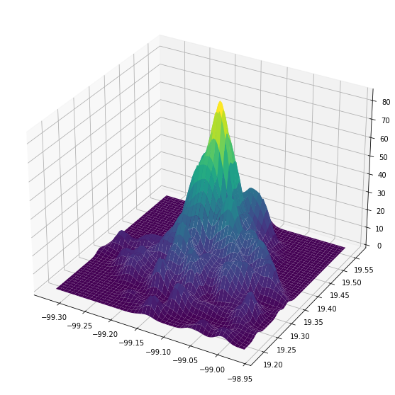

# criminologia_cdmx
> Herramientas para el análisis espacial de la delincuencia en la CDMX.


## Instalación

`pip install criminologia_cdmx`

## Uso

## ETL
````Python
from criminologia_cdmx.etl import *
````

### Bajar datos abiertos

Hay dos formas de bajar los datos abiertos, la primera es usando el api que baja las primeras `limit` carpetas de la base abierta

```python
carpetas = get_carpetas_from_api(limit=100)
carpetas.head()
```


<div>
<style scoped>
    .dataframe tbody tr th:only-of-type {
        vertical-align: middle;
    }

    .dataframe tbody tr th {
        vertical-align: top;
    }

    .dataframe thead th {
        text-align: right;
    }
</style>
<table border="1" class="dataframe">
  <thead>
    <tr style="text-align: right;">
      <th></th>
      <th>_id</th>
      <th>ao_hechos</th>
      <th>mes_hechos</th>
      <th>fecha_hechos</th>
      <th>ao_inicio</th>
      <th>mes_inicio</th>
      <th>fecha_inicio</th>
      <th>delito</th>
      <th>fiscalia</th>
      <th>agencia</th>
      <th>...</th>
      <th>categoria_delito</th>
      <th>calle_hechos</th>
      <th>calle_hechos2</th>
      <th>colonia_hechos</th>
      <th>alcaldia_hechos</th>
      <th>competencia</th>
      <th>longitud</th>
      <th>latitud</th>
      <th>tempo</th>
      <th>geometry</th>
    </tr>
  </thead>
  <tbody>
    <tr>
      <th>0</th>
      <td>1024416</td>
      <td>2020</td>
      <td>Junio</td>
      <td>2020-06-18 11:30:00</td>
      <td>2020</td>
      <td>Junio</td>
      <td>2020-06-18T15:41:11</td>
      <td>AMENAZAS</td>
      <td>FISCALÍA DE INVESTIGACIÓN TERRITORIAL EN BENIT...</td>
      <td>BJ-3</td>
      <td>...</td>
      <td>DELITO DE BAJO IMPACTO</td>
      <td>MIGUEL LAURENT</td>
      <td>NaN</td>
      <td>LETRÁN VALLE</td>
      <td>BENITO JUAREZ</td>
      <td>NaN</td>
      <td>-99.1615631604095</td>
      <td>19.3745426161242</td>
      <td>NaN</td>
      <td>POINT (-99.16156 19.37454)</td>
    </tr>
    <tr>
      <th>1</th>
      <td>1024417</td>
      <td>2020</td>
      <td>Junio</td>
      <td>2020-06-13 14:00:00</td>
      <td>2020</td>
      <td>Junio</td>
      <td>2020-06-18T15:42:35</td>
      <td>SUSTRACCIÓN DE MENORES</td>
      <td>FISCALÍA DE INVESTIGACIÓN TERRITORIAL EN IZTAC...</td>
      <td>IZC-2</td>
      <td>...</td>
      <td>DELITO DE BAJO IMPACTO</td>
      <td>TLACOTAL C</td>
      <td>NaN</td>
      <td>GABRIEL RAMOS MILLÁN SECCIÓN TLACOTAL</td>
      <td>IZTACALCO</td>
      <td>NaN</td>
      <td>-99.105716711431</td>
      <td>19.3953360477985</td>
      <td>NaN</td>
      <td>POINT (-99.10572 19.39534)</td>
    </tr>
    <tr>
      <th>2</th>
      <td>1024418</td>
      <td>2020</td>
      <td>Junio</td>
      <td>2020-06-18 14:40:00</td>
      <td>2020</td>
      <td>Junio</td>
      <td>2020-06-18T15:42:41</td>
      <td>ROBO A NEGOCIO CON VIOLENCIA</td>
      <td>FISCALÍA DE INVESTIGACIÓN TERRITORIAL EN IZTAP...</td>
      <td>IZP-6</td>
      <td>...</td>
      <td>ROBO A NEGOCIO CON VIOLENCIA</td>
      <td>AV. DEL ARBOL</td>
      <td>HORTENCIA</td>
      <td>LOMAS DE SAN LORENZO</td>
      <td>IZTAPALAPA</td>
      <td>NaN</td>
      <td>-99.0689250062205</td>
      <td>19.3157102852289</td>
      <td>NaN</td>
      <td>POINT (-99.06893 19.31571)</td>
    </tr>
    <tr>
      <th>3</th>
      <td>1024419</td>
      <td>2020</td>
      <td>Mayo</td>
      <td>2020-05-30 12:00:00</td>
      <td>2020</td>
      <td>Junio</td>
      <td>2020-06-18T15:45:31</td>
      <td>ROBO DE VEHICULO DE SERVICIO PARTICULAR SIN VI...</td>
      <td>FISCALÍA DE INVESTIGACIÓN TERRITORIAL EN IZTAP...</td>
      <td>IZP-5</td>
      <td>...</td>
      <td>ROBO DE VEHÍCULO CON Y SIN VIOLENCIA</td>
      <td>NAUTLA</td>
      <td>NaN</td>
      <td>SAN JUAN XALPA</td>
      <td>IZTAPALAPA</td>
      <td>NaN</td>
      <td>-99.0847959998612</td>
      <td>19.3354113029671</td>
      <td>NaN</td>
      <td>POINT (-99.08480 19.33541)</td>
    </tr>
    <tr>
      <th>4</th>
      <td>1024420</td>
      <td>2020</td>
      <td>Junio</td>
      <td>2020-06-17 05:30:00</td>
      <td>2020</td>
      <td>Junio</td>
      <td>2020-06-18T15:46:08</td>
      <td>ROBO DE ACCESORIOS DE AUTO</td>
      <td>AGENCIA DE DENUNCIA DIGITAL</td>
      <td>CEN-1</td>
      <td>...</td>
      <td>DELITO DE BAJO IMPACTO</td>
      <td>UNION</td>
      <td>12 DE OCTUBRE</td>
      <td>ESCANDÓN I SECCIÓN</td>
      <td>MIGUEL HIDALGO</td>
      <td>NaN</td>
      <td>-99.1753293004536</td>
      <td>19.3993953040539</td>
      <td>NaN</td>
      <td>POINT (-99.17533 19.39940)</td>
    </tr>
  </tbody>
</table>
<p>5 rows × 21 columns</p>
</div>


La segunda es bajar el histórico completo:

````Python
carpetas_todas = get_historico_carpetas()
````

## Agregar identificadores espaciales

Para agregar los identificadores de colonia y cuadrante:

```python
carpetas = agrega_ids_espaciales(carpetas)
carpetas.head()
```


<div>
<style scoped>
    .dataframe tbody tr th:only-of-type {
        vertical-align: middle;
    }

    .dataframe tbody tr th {
        vertical-align: top;
    }

    .dataframe thead th {
        text-align: right;
    }
</style>
<table border="1" class="dataframe">
  <thead>
    <tr style="text-align: right;">
      <th></th>
      <th>_id</th>
      <th>ao_hechos</th>
      <th>mes_hechos</th>
      <th>fecha_hechos</th>
      <th>ao_inicio</th>
      <th>mes_inicio</th>
      <th>fecha_inicio</th>
      <th>delito</th>
      <th>fiscalia</th>
      <th>agencia</th>
      <th>...</th>
      <th>colonia_hechos</th>
      <th>alcaldia_hechos</th>
      <th>competencia</th>
      <th>longitud</th>
      <th>latitud</th>
      <th>tempo</th>
      <th>geometry</th>
      <th>colonia_cve</th>
      <th>colonia_nombre</th>
      <th>cuadrante_id</th>
    </tr>
  </thead>
  <tbody>
    <tr>
      <th>0</th>
      <td>1024416</td>
      <td>2020</td>
      <td>Junio</td>
      <td>2020-06-18 11:30:00</td>
      <td>2020</td>
      <td>Junio</td>
      <td>2020-06-18T15:41:11</td>
      <td>AMENAZAS</td>
      <td>FISCALÍA DE INVESTIGACIÓN TERRITORIAL EN BENIT...</td>
      <td>BJ-3</td>
      <td>...</td>
      <td>LETRÁN VALLE</td>
      <td>BENITO JUAREZ</td>
      <td>NaN</td>
      <td>-99.1615631604095</td>
      <td>19.3745426161242</td>
      <td>NaN</td>
      <td>POINT (-99.16156 19.37454)</td>
      <td>932</td>
      <td>LETRAN VALLE</td>
      <td>013</td>
    </tr>
    <tr>
      <th>25</th>
      <td>1024440</td>
      <td>2020</td>
      <td>Junio</td>
      <td>2020-06-18 16:00:00</td>
      <td>2020</td>
      <td>Junio</td>
      <td>2020-06-18T16:25:08</td>
      <td>ROBO A NEGOCIO SIN VIOLENCIA POR FARDEROS (TIE...</td>
      <td>FISCALÍA DE INVESTIGACIÓN TERRITORIAL EN BENIT...</td>
      <td>BJ-2</td>
      <td>...</td>
      <td>SANTA CRUZ ATOYAC</td>
      <td>BENITO JUAREZ</td>
      <td>NaN</td>
      <td>-99.1644768802292</td>
      <td>19.3708053008306</td>
      <td>NaN</td>
      <td>POINT (-99.16448 19.37081)</td>
      <td>927</td>
      <td>STA CRUZ ATOYAC</td>
      <td>013</td>
    </tr>
    <tr>
      <th>1</th>
      <td>1024417</td>
      <td>2020</td>
      <td>Junio</td>
      <td>2020-06-13 14:00:00</td>
      <td>2020</td>
      <td>Junio</td>
      <td>2020-06-18T15:42:35</td>
      <td>SUSTRACCIÓN DE MENORES</td>
      <td>FISCALÍA DE INVESTIGACIÓN TERRITORIAL EN IZTAC...</td>
      <td>IZC-2</td>
      <td>...</td>
      <td>GABRIEL RAMOS MILLÁN SECCIÓN TLACOTAL</td>
      <td>IZTACALCO</td>
      <td>NaN</td>
      <td>-99.105716711431</td>
      <td>19.3953360477985</td>
      <td>NaN</td>
      <td>POINT (-99.10572 19.39534)</td>
      <td>898</td>
      <td>TLACOTAL RAMOS MILLAN</td>
      <td>025</td>
    </tr>
    <tr>
      <th>2</th>
      <td>1024418</td>
      <td>2020</td>
      <td>Junio</td>
      <td>2020-06-18 14:40:00</td>
      <td>2020</td>
      <td>Junio</td>
      <td>2020-06-18T15:42:41</td>
      <td>ROBO A NEGOCIO CON VIOLENCIA</td>
      <td>FISCALÍA DE INVESTIGACIÓN TERRITORIAL EN IZTAP...</td>
      <td>IZP-6</td>
      <td>...</td>
      <td>LOMAS DE SAN LORENZO</td>
      <td>IZTAPALAPA</td>
      <td>NaN</td>
      <td>-99.0689250062205</td>
      <td>19.3157102852289</td>
      <td>NaN</td>
      <td>POINT (-99.06893 19.31571)</td>
      <td>389</td>
      <td>SAN LORENZO TEZONCO (PBLO)</td>
      <td>017</td>
    </tr>
    <tr>
      <th>3</th>
      <td>1024419</td>
      <td>2020</td>
      <td>Mayo</td>
      <td>2020-05-30 12:00:00</td>
      <td>2020</td>
      <td>Junio</td>
      <td>2020-06-18T15:45:31</td>
      <td>ROBO DE VEHICULO DE SERVICIO PARTICULAR SIN VI...</td>
      <td>FISCALÍA DE INVESTIGACIÓN TERRITORIAL EN IZTAP...</td>
      <td>IZP-5</td>
      <td>...</td>
      <td>SAN JUAN XALPA</td>
      <td>IZTAPALAPA</td>
      <td>NaN</td>
      <td>-99.0847959998612</td>
      <td>19.3354113029671</td>
      <td>NaN</td>
      <td>POINT (-99.08480 19.33541)</td>
      <td>1413</td>
      <td>SAN JUAN XALPA I</td>
      <td>013</td>
    </tr>
  </tbody>
</table>
<p>5 rows × 24 columns</p>
</div>


## Agregar categorías de usuario

Para clasificar los delitos de acuerdo a una categorización definida por el usuario necesitamos un archivo que relacione la columna delitos de la base de carpetas con las categorías definidas por el usuario

```python
categorias = pd.read_csv("datos/categorias_incidentes.csv")
categorias
```


<div>
<style scoped>
    .dataframe tbody tr th:only-of-type {
        vertical-align: middle;
    }

    .dataframe tbody tr th {
        vertical-align: top;
    }

    .dataframe thead th {
        text-align: right;
    }
</style>
<table border="1" class="dataframe">
  <thead>
    <tr style="text-align: right;">
      <th></th>
      <th>incidente</th>
      <th>categoria</th>
    </tr>
  </thead>
  <tbody>
    <tr>
      <th>0</th>
      <td>HOMICIDIO POR AHORCAMIENTO</td>
      <td>Homicidios dolosos</td>
    </tr>
    <tr>
      <th>1</th>
      <td>HOMICIDIO POR ARMA BLANCA</td>
      <td>Homicidios dolosos</td>
    </tr>
    <tr>
      <th>2</th>
      <td>HOMICIDIO POR ARMA DE FUEGO</td>
      <td>Homicidios dolosos</td>
    </tr>
    <tr>
      <th>3</th>
      <td>HOMICIDIO POR GOLPES</td>
      <td>Homicidios dolosos</td>
    </tr>
    <tr>
      <th>4</th>
      <td>HOMICIDIOS INTENCIONALES (OTROS)</td>
      <td>Homicidios dolosos</td>
    </tr>
    <tr>
      <th>...</th>
      <td>...</td>
      <td>...</td>
    </tr>
    <tr>
      <th>73</th>
      <td>ROBO DE VEHICULO DE SERVICIO PÚBLICO CON VIOLE...</td>
      <td>Robo de/en vehículo</td>
    </tr>
    <tr>
      <th>74</th>
      <td>ROBO DE VEHICULO DE SERVICIO PÚBLICO SIN VIOLE...</td>
      <td>Robo de/en vehículo</td>
    </tr>
    <tr>
      <th>75</th>
      <td>ROBO DE VEHICULO ELECTRICO MOTOPATIN</td>
      <td>Robo de/en vehículo</td>
    </tr>
    <tr>
      <th>76</th>
      <td>OBO DE VEHICULO EN PENSION, TALLER Y AGENCIAS C/V</td>
      <td>Robo de/en vehículo</td>
    </tr>
    <tr>
      <th>77</th>
      <td>ROBO DE VEHICULO EN PENSION, TALLER Y AGENCIAS...</td>
      <td>Robo de/en vehículo</td>
    </tr>
  </tbody>
</table>
<p>78 rows × 2 columns</p>
</div>


Entonces podemos agregar las categorías a nuestra base

```python
carpetas = agregar_categorias_de_usuario(carpetas)
carpetas[['delito', 'categoria']]
```


<div>
<style scoped>
    .dataframe tbody tr th:only-of-type {
        vertical-align: middle;
    }

    .dataframe tbody tr th {
        vertical-align: top;
    }

    .dataframe thead th {
        text-align: right;
    }
</style>
<table border="1" class="dataframe">
  <thead>
    <tr style="text-align: right;">
      <th></th>
      <th>delito</th>
      <th>categoria</th>
    </tr>
  </thead>
  <tbody>
    <tr>
      <th>0</th>
      <td>AMENAZAS</td>
      <td>NaN</td>
    </tr>
    <tr>
      <th>1</th>
      <td>ROBO A NEGOCIO SIN VIOLENCIA POR FARDEROS (TIE...</td>
      <td>Robo a negocio</td>
    </tr>
    <tr>
      <th>2</th>
      <td>SUSTRACCIÓN DE MENORES</td>
      <td>NaN</td>
    </tr>
    <tr>
      <th>3</th>
      <td>ROBO A NEGOCIO CON VIOLENCIA</td>
      <td>Robo a negocio</td>
    </tr>
    <tr>
      <th>4</th>
      <td>ROBO DE VEHICULO DE SERVICIO PARTICULAR SIN VI...</td>
      <td>Robo de/en vehículo</td>
    </tr>
    <tr>
      <th>...</th>
      <td>...</td>
      <td>...</td>
    </tr>
    <tr>
      <th>92</th>
      <td>ROBO DE OBJETOS DEL INTERIOR DE UN VEHICULO</td>
      <td>Robo de/en vehículo</td>
    </tr>
    <tr>
      <th>93</th>
      <td>CONTRA LA INTIMIDAD SEXUAL</td>
      <td>NaN</td>
    </tr>
    <tr>
      <th>94</th>
      <td>VIOLENCIA FAMILIAR</td>
      <td>NaN</td>
    </tr>
    <tr>
      <th>95</th>
      <td>VIOLACION</td>
      <td>NaN</td>
    </tr>
    <tr>
      <th>96</th>
      <td>FRAUDE</td>
      <td>NaN</td>
    </tr>
  </tbody>
</table>
<p>97 rows × 2 columns</p>
</div>


## Patrones espacio temporales

Este módulo tiene diferentes herramientas para explorar los patrones espacio-temporales de la actividad delictiva
````Python
from criminologia_cdmx.patrones_espacio_temporales import *
````

### Estimación de densidad de kernel
A partir de cualquier capa de incidentes se puede estimar el KDE utilizando validación cruzada para encontrar el mejor bandwidth

```python
carpetas = get_carpetas_from_api(1000)
x = carpetas.geometry.x.to_numpy()
y = carpetas.geometry.y.to_numpy()
params = {'bandwidth': np.linspace(0.001, 0.1, 100)}
bw = ajusta_bandwidth_kde(x, y, params)
xx, yy, zz = kde2D(x, y, bw, xbins=100j, ybins=100j)
fig = plt.figure(figsize=(10,10))
ax = plt.axes(projection='3d')
ax.plot_surface(xx, yy, zz,cmap='viridis', edgecolor='none')
```


    <mpl_toolkits.mplot3d.art3d.Poly3DCollection at 0x7fe3262c3c70>





### Serie de tiempo de KDEs por categoría

Para una categoría determinada se obtiene la serie de tiempo de densidades de Kernel para un periodo arbitrario, utilizando la agregación temporal determinada por el usuario.

Para usar esta función no es necesario agregar los ids de unidades espaciales

```python
carpetas = get_historico_carpetas()
carpetas = agregar_categorias_de_usuario(carpetas)
fechas = pd.date_range(start='1/1/2017', end='1/1/2020', freq='M').to_list()
kdes = serie_tiempo_kde_categoria(carpetas, fechas, "Homicidios dolosos", "30 days")
```

    /tmp/ipykernel_25308/253724238.py:1: DtypeWarning: Columns (15) have mixed types.Specify dtype option on import or set low_memory=False.
      carpetas = get_historico_carpetas()


A partir de esta serie de kdes es relatívamente fácil obtener una animación de la evolución:

```python
import matplotlib.animation as animation
def data(t):
    d = kdes[t]
    ax.clear()
    surf = ax.plot_surface(XX, YY, d[2], cmap='viridis', edgecolor='none', antialiased=False)
    ax.set_zlim([0,50]) # set zlim to be always the same for every frame


fig = plt.figure(figsize=(10,10))
ax = fig.gca(projection='3d')
XX = kdes[0][0]
YY = kdes[0][1]
surf = ax.plot_surface(XX, YY, kdes[0][2],cmap='viridis', edgecolor='none', antialiased=False)
ax.set_zlim(0, 50)
# ax.zaxis.set_major_locator(LinearLocator(10))
# fig.colorbar(surf, shrink=0.5, aspect=10)
# ax.set_xlabel('X nodes - Axis')
# ax.set_ylabel('Y nodes - Axis')
# ax.set_zlabel('Value')

ani = animation.FuncAnimation(fig, data, len(kdes), interval=50, repeat=True )
plt.show()
```

    /tmp/ipykernel_25308/3416935710.py:10: MatplotlibDeprecationWarning: Calling gca() with keyword arguments was deprecated in Matplotlib 3.4. Starting two minor releases later, gca() will take no keyword arguments. The gca() function should only be used to get the current axes, or if no axes exist, create new axes with default keyword arguments. To create a new axes with non-default arguments, use plt.axes() or plt.subplot().
      ax = fig.gca(projection='3d')


```python
len(kdes)
```


    1


