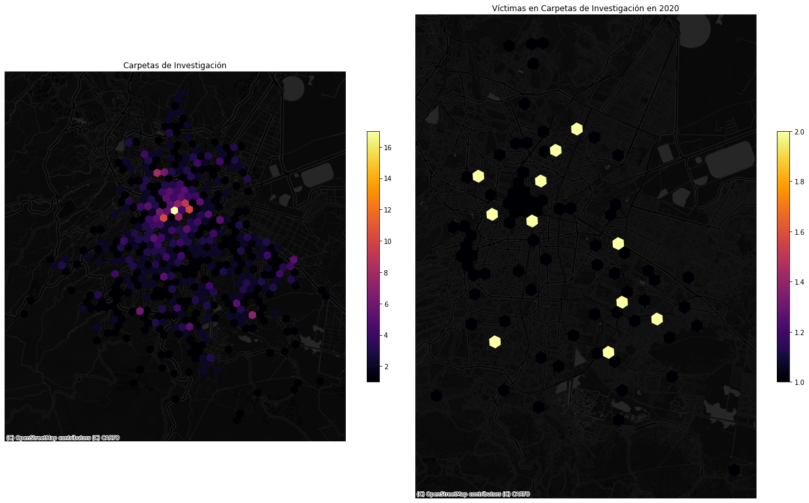

# criminologia_cdmx
> Herramientas para el análisis espacial de la delincuencia en la CDMX.


## Instalación

La forma más sencilla de instalarlo es creando un environment de conda que tenga geopandas instalado y después usar `pip` para instalar la librería dese el repositorio:


````bash
conda create -n criminologia python=3.8
conda install -c conda-forge geopandas
pip install git+https://github.com/CentroGeo/criminologia_cdmx
````

Por lo pronto, como el repositorio es privado Git va a pedir usuario y contraseña de GitHub.

Alternativamente, si tienes el repositorio clonado en la computadora:

````bash
conda create -n criminologia python=3.8
conda install -c conda-forge geopandas
pip install git+file///ruta/a/criminologia_cdmx
````

## Uso

## ETL
````Python
from criminologia_cdmx.etl import *
````

### Bajar datos abiertos

Podemos bajar dos fuentes de datos: [carpetas de investigación](https://datos.cdmx.gob.mx/dataset/carpetas-de-investigacion-fgj-de-la-ciudad-de-mexico) y [víctimas en carpetas de investigación](https://datos.cdmx.gob.mx/dataset/victimas-en-carpetas-de-investigacion-fgj/resource/d543a7b1-f8cb-439f-8a5c-e56c5479eeb5).

Hay dos formas de bajar los datos abiertos, la primera es usando el api que baja las primeras `limit` carpetas/víctimas de la base abierta

```python
carpetas = get_carpetas_from_api(limit=100)
carpetas.head()
```


<div>
<style scoped>
    .dataframe tbody tr th:only-of-type {
        vertical-align: middle;
    }

    .dataframe tbody tr th {
        vertical-align: top;
    }

    .dataframe thead th {
        text-align: right;
    }
</style>
<table border="1" class="dataframe">
  <thead>
    <tr style="text-align: right;">
      <th></th>
      <th>_id</th>
      <th>ao_hechos</th>
      <th>mes_hechos</th>
      <th>fecha_hechos</th>
      <th>ao_inicio</th>
      <th>mes_inicio</th>
      <th>fecha_inicio</th>
      <th>delito</th>
      <th>fiscalia</th>
      <th>agencia</th>
      <th>...</th>
      <th>categoria_delito</th>
      <th>calle_hechos</th>
      <th>calle_hechos2</th>
      <th>colonia_hechos</th>
      <th>alcaldia_hechos</th>
      <th>competencia</th>
      <th>longitud</th>
      <th>latitud</th>
      <th>tempo</th>
      <th>geometry</th>
    </tr>
  </thead>
  <tbody>
    <tr>
      <th>0</th>
      <td>1</td>
      <td>2016</td>
      <td>Enero</td>
      <td>2016-01-31 22:16:00</td>
      <td>2016</td>
      <td>Febrero</td>
      <td>2016-02-01T00:25:44</td>
      <td>DAÑO EN PROPIEDAD AJENA INTENCIONAL</td>
      <td>INVESTIGACIÓN EN BENITO JUÁREZ</td>
      <td>BJ-2</td>
      <td>...</td>
      <td>DELITO DE BAJO IMPACTO</td>
      <td>CALZ. DE TLALPAN</td>
      <td>LAGO PTE.</td>
      <td>AMÉRICAS UNIDAS</td>
      <td>BENITO JUAREZ</td>
      <td>NaN</td>
      <td>-99.1402149999999</td>
      <td>19.3803149998337</td>
      <td>NaN</td>
      <td>POINT (-99.14021 19.38031)</td>
    </tr>
    <tr>
      <th>1</th>
      <td>2</td>
      <td>2016</td>
      <td>Enero</td>
      <td>2016-01-31 20:50:00</td>
      <td>2016</td>
      <td>Febrero</td>
      <td>2016-02-01T00:52:37</td>
      <td>ROBO DE VEHICULO DE SERVICIO PARTICULAR CON VI...</td>
      <td>INVESTIGACIÓN PARA LA ATENCIÓN DEL DELITO DE R...</td>
      <td>ORIENTEII</td>
      <td>...</td>
      <td>ROBO DE VEHÍCULO CON Y SIN VIOLENCIA</td>
      <td>SUR 25 A</td>
      <td>GRANJEROS</td>
      <td>LOS CIPRESES</td>
      <td>IZTAPALAPA</td>
      <td>NaN</td>
      <td>-99.1084029999999</td>
      <td>19.3528589998337</td>
      <td>NaN</td>
      <td>POINT (-99.10840 19.35286)</td>
    </tr>
    <tr>
      <th>2</th>
      <td>3</td>
      <td>2016</td>
      <td>Febrero</td>
      <td>2016-02-01 00:30:00</td>
      <td>2016</td>
      <td>Febrero</td>
      <td>2016-02-01T01:33:26</td>
      <td>NARCOMENUDEO POSESION SIMPLE</td>
      <td>INVESTIGACIÓN PARA LA ATENCIÓN DE NIÑOS, NIÑAS...</td>
      <td>57</td>
      <td>...</td>
      <td>DELITO DE BAJO IMPACTO</td>
      <td>BATALLONES ROJOS</td>
      <td>NaN</td>
      <td>UNIDAD VICENTE GUERRERO</td>
      <td>IZTAPALAPA</td>
      <td>NaN</td>
      <td>-99.061321</td>
      <td>19.3564509998336</td>
      <td>NaN</td>
      <td>POINT (-99.06132 19.35645)</td>
    </tr>
    <tr>
      <th>3</th>
      <td>4</td>
      <td>2016</td>
      <td>Enero</td>
      <td>2016-01-31 22:00:00</td>
      <td>2016</td>
      <td>Febrero</td>
      <td>2016-02-01T02:09:11</td>
      <td>ROBO A TRANSEUNTE EN VIA PUBLICA CON VIOLENCIA</td>
      <td>INVESTIGACIÓN EN IZTAPALAPA</td>
      <td>IZP-6</td>
      <td>...</td>
      <td>ROBO A TRANSEUNTE EN VÍA PÚBLICA CON Y SIN VIO...</td>
      <td>GERANIO</td>
      <td>GAVILLEROS</td>
      <td>EMILIANO ZAPATA</td>
      <td>IZTAPALAPA</td>
      <td>NaN</td>
      <td>-98.9763790000001</td>
      <td>19.3316329998333</td>
      <td>NaN</td>
      <td>POINT (-98.97638 19.33163)</td>
    </tr>
    <tr>
      <th>4</th>
      <td>5</td>
      <td>2015</td>
      <td>Diciembre</td>
      <td>2015-12-25 12:00:00</td>
      <td>2016</td>
      <td>Febrero</td>
      <td>2016-02-01T02:16:49</td>
      <td>DENUNCIA DE HECHOS</td>
      <td>INVESTIGACIÓN EN BENITO JUÁREZ</td>
      <td>BJ-1</td>
      <td>...</td>
      <td>HECHO NO DELICTIVO</td>
      <td>SAN FRANCISCO</td>
      <td>AVENIDA COLONIA DEL VALLE</td>
      <td>DEL VALLE CENTRO</td>
      <td>BENITO JUAREZ</td>
      <td>NaN</td>
      <td>-99.1721889999999</td>
      <td>19.387113999834</td>
      <td>NaN</td>
      <td>POINT (-99.17219 19.38711)</td>
    </tr>
  </tbody>
</table>
<p>5 rows × 21 columns</p>
</div>


```python
victimas = get_victimas_from_api(limit=100)
victimas.head()
```


<div>
<style scoped>
    .dataframe tbody tr th:only-of-type {
        vertical-align: middle;
    }

    .dataframe tbody tr th {
        vertical-align: top;
    }

    .dataframe thead th {
        text-align: right;
    }
</style>
<table border="1" class="dataframe">
  <thead>
    <tr style="text-align: right;">
      <th></th>
      <th>_id</th>
      <th>idCarpeta</th>
      <th>Ano_inicio</th>
      <th>Mes_inicio</th>
      <th>FechaInicio</th>
      <th>delito</th>
      <th>categoria</th>
      <th>Sexo</th>
      <th>Edad</th>
      <th>TipoPersona</th>
      <th>...</th>
      <th>fecha_hechos</th>
      <th>HoraHecho</th>
      <th>HoraInicio</th>
      <th>AlcaldiaHechos</th>
      <th>ColoniaHechos</th>
      <th>Calle_hechos</th>
      <th>Calle_hechos2</th>
      <th>latitud</th>
      <th>longitud</th>
      <th>geometry</th>
    </tr>
  </thead>
  <tbody>
    <tr>
      <th>0</th>
      <td>1</td>
      <td>8324429</td>
      <td>2019</td>
      <td>Enero</td>
      <td>2019-04-01T00:00:00</td>
      <td>FRAUDE</td>
      <td>DELITO DE BAJO IMPACTO</td>
      <td>Masculino</td>
      <td>62</td>
      <td>FISICA</td>
      <td>...</td>
      <td>2018-08-29</td>
      <td>12:00:00</td>
      <td>12:19:00</td>
      <td>ALVARO OBREGON</td>
      <td>GUADALUPE INN</td>
      <td>INSUGENTES SUR</td>
      <td>NaN</td>
      <td>19.36125</td>
      <td>-99.18314</td>
      <td>POINT (-99.18314 19.36125)</td>
    </tr>
    <tr>
      <th>1</th>
      <td>2</td>
      <td>8324430</td>
      <td>2019</td>
      <td>Enero</td>
      <td>2019-04-01T00:00:00</td>
      <td>PRODUCCIÓN, IMPRESIÓN, ENAJENACIÓN, DISTRIBUCI...</td>
      <td>DELITO DE BAJO IMPACTO</td>
      <td>Femenino</td>
      <td>38</td>
      <td>FISICA</td>
      <td>...</td>
      <td>2018-12-15</td>
      <td>15:00:00</td>
      <td>12:20:00</td>
      <td>AZCAPOTZALCO</td>
      <td>VICTORIA DE LAS DEMOCRACIAS</td>
      <td>AV.  CUATLAHUAC</td>
      <td>NaN</td>
      <td>19.47181</td>
      <td>-99.16458</td>
      <td>POINT (-99.16458 19.47181)</td>
    </tr>
    <tr>
      <th>2</th>
      <td>3</td>
      <td>8324431</td>
      <td>2019</td>
      <td>Enero</td>
      <td>2019-04-01T00:00:00</td>
      <td>ROBO A TRANSEUNTE SALIENDO DEL BANCO CON VIOLE...</td>
      <td>ROBO A CUENTAHABIENTE SALIENDO DEL CAJERO CON ...</td>
      <td>Masculino</td>
      <td>42</td>
      <td>FISICA</td>
      <td>...</td>
      <td>2018-12-22</td>
      <td>15:30:00</td>
      <td>12:23:00</td>
      <td>COYOACAN</td>
      <td>COPILCO UNIVERSIDAD ISSSTE</td>
      <td>COPILCO</td>
      <td>NaN</td>
      <td>19.33797</td>
      <td>-99.18611</td>
      <td>POINT (-99.18611 19.33797)</td>
    </tr>
    <tr>
      <th>3</th>
      <td>4</td>
      <td>8324435</td>
      <td>2019</td>
      <td>Enero</td>
      <td>2019-04-01T00:00:00</td>
      <td>ROBO DE VEHICULO DE SERVICIO PARTICULAR SIN VI...</td>
      <td>ROBO DE VEHÍCULO CON Y SIN VIOLENCIA</td>
      <td>Masculino</td>
      <td>35</td>
      <td>FISICA</td>
      <td>...</td>
      <td>2019-01-04</td>
      <td>06:00:00</td>
      <td>12:27:00</td>
      <td>IZTACALCO</td>
      <td>AGRÍCOLA PANTITLAN</td>
      <td>CALLE 6</td>
      <td>ENTRE PRIVADA DEL VALLE Y PRIVADA GONZALEZ</td>
      <td>19.40327</td>
      <td>-99.05983</td>
      <td>POINT (-99.05983 19.40327)</td>
    </tr>
    <tr>
      <th>4</th>
      <td>5</td>
      <td>8324438</td>
      <td>2019</td>
      <td>Enero</td>
      <td>2019-04-01T00:00:00</td>
      <td>ROBO DE MOTOCICLETA SIN VIOLENCIA</td>
      <td>ROBO DE VEHÍCULO CON Y SIN VIOLENCIA</td>
      <td>Masculino</td>
      <td>NaN</td>
      <td>FISICA</td>
      <td>...</td>
      <td>2019-01-03</td>
      <td>20:00:00</td>
      <td>12:35:00</td>
      <td>IZTAPALAPA</td>
      <td>PROGRESISTA</td>
      <td>UNIVERSIDAD</td>
      <td>NaN</td>
      <td>19.3548</td>
      <td>-99.06324</td>
      <td>POINT (-99.06324 19.35480)</td>
    </tr>
  </tbody>
</table>
<p>5 rows × 24 columns</p>
</div>


La segunda es bajar el histórico completo:

````Python
carpetas_todas = get_historico_carpetas()
victimas_todas = get_historico_victimas()
````

También es posible procesar los datos a partir de un archivo guardado en la computadora, ya sea obtenido de la página de datos abiertos o guardado con las funciones `get_historico_carpetas`/`get_historico_victimas`.

````Python
carpetas = get_carpetas_desde_archivo("path-a-los-datos")
victimas_todas = get_victimas_desde_archivo("path-a-los-datos")
````

### Agregar identificadores espaciales (carpetas o victimas)

Podemos agregar fácilmente identificadores para diferentes unidades espaciales:

* manzanas (del marco censal 2020)
* colonias (datos abiertos cdmx)
* cuadrantes (datos abiertos cdmx)

Hay dos métodos diferentes para agregar los identificadores espaciales: `poligonos` y `manzanas`. El primero hace la unión espacial directa entre los puntos de los incidentes (carpetas o víctimas) y las geometrías de colonias y cuadrantes (no agrega ids de manzanas), el segundo hace la unión por vecino más cercano entre los incidentes y la geometría de las manzanas, después agrega los ids de colonia y cuadrante a través de la relación entre manzanas y los niveles superiores que ya viene modelada en los datos. Por la forma en la que se hacen las uniones los resultados entre ambos métodos no son exáctamente iguales.

Para usar el método `manzanas` es necesario primero descargar los datos:

```python
descarga_manzanas()
```

    El archivo ya está descargado.


```python
carpetas = agrega_ids_espaciales(carpetas)
carpetas.head()
```


<div>
<style scoped>
    .dataframe tbody tr th:only-of-type {
        vertical-align: middle;
    }

    .dataframe tbody tr th {
        vertical-align: top;
    }

    .dataframe thead th {
        text-align: right;
    }
</style>
<table border="1" class="dataframe">
  <thead>
    <tr style="text-align: right;">
      <th></th>
      <th>_id</th>
      <th>ao_hechos</th>
      <th>mes_hechos</th>
      <th>fecha_hechos</th>
      <th>ao_inicio</th>
      <th>mes_inicio</th>
      <th>fecha_inicio</th>
      <th>delito</th>
      <th>fiscalia</th>
      <th>agencia</th>
      <th>...</th>
      <th>alcaldia_hechos</th>
      <th>competencia</th>
      <th>longitud</th>
      <th>latitud</th>
      <th>tempo</th>
      <th>geometry</th>
      <th>manzana_cvegeo</th>
      <th>municipio_cvegeo</th>
      <th>colonia_cve</th>
      <th>cuadrante_id</th>
    </tr>
  </thead>
  <tbody>
    <tr>
      <th>0</th>
      <td>1</td>
      <td>2016</td>
      <td>Enero</td>
      <td>2016-01-31 22:16:00</td>
      <td>2016</td>
      <td>Febrero</td>
      <td>2016-02-01T00:25:44</td>
      <td>DAÑO EN PROPIEDAD AJENA INTENCIONAL</td>
      <td>INVESTIGACIÓN EN BENITO JUÁREZ</td>
      <td>BJ-2</td>
      <td>...</td>
      <td>BENITO JUAREZ</td>
      <td>NaN</td>
      <td>-99.1402149999999</td>
      <td>19.3803149998337</td>
      <td>NaN</td>
      <td>POINT (-99.14021 19.38031)</td>
      <td>0901400010505010</td>
      <td>09014</td>
      <td>948</td>
      <td>016</td>
    </tr>
    <tr>
      <th>1</th>
      <td>2</td>
      <td>2016</td>
      <td>Enero</td>
      <td>2016-01-31 20:50:00</td>
      <td>2016</td>
      <td>Febrero</td>
      <td>2016-02-01T00:52:37</td>
      <td>ROBO DE VEHICULO DE SERVICIO PARTICULAR CON VI...</td>
      <td>INVESTIGACIÓN PARA LA ATENCIÓN DEL DELITO DE R...</td>
      <td>ORIENTEII</td>
      <td>...</td>
      <td>IZTAPALAPA</td>
      <td>NaN</td>
      <td>-99.1084029999999</td>
      <td>19.3528589998337</td>
      <td>NaN</td>
      <td>POINT (-99.10840 19.35286)</td>
      <td>0900700011195011</td>
      <td>09007</td>
      <td>1303</td>
      <td>0111</td>
    </tr>
    <tr>
      <th>2</th>
      <td>3</td>
      <td>2016</td>
      <td>Febrero</td>
      <td>2016-02-01 00:30:00</td>
      <td>2016</td>
      <td>Febrero</td>
      <td>2016-02-01T01:33:26</td>
      <td>NARCOMENUDEO POSESION SIMPLE</td>
      <td>INVESTIGACIÓN PARA LA ATENCIÓN DE NIÑOS, NIÑAS...</td>
      <td>57</td>
      <td>...</td>
      <td>IZTAPALAPA</td>
      <td>NaN</td>
      <td>-99.061321</td>
      <td>19.3564509998336</td>
      <td>NaN</td>
      <td>POINT (-99.06132 19.35645)</td>
      <td>0900700011034012</td>
      <td>09007</td>
      <td>1373</td>
      <td>0111</td>
    </tr>
    <tr>
      <th>3</th>
      <td>4</td>
      <td>2016</td>
      <td>Enero</td>
      <td>2016-01-31 22:00:00</td>
      <td>2016</td>
      <td>Febrero</td>
      <td>2016-02-01T02:09:11</td>
      <td>ROBO A TRANSEUNTE EN VIA PUBLICA CON VIOLENCIA</td>
      <td>INVESTIGACIÓN EN IZTAPALAPA</td>
      <td>IZP-6</td>
      <td>...</td>
      <td>IZTAPALAPA</td>
      <td>NaN</td>
      <td>-98.9763790000001</td>
      <td>19.3316329998333</td>
      <td>NaN</td>
      <td>POINT (-98.97638 19.33163)</td>
      <td>090070001426A031</td>
      <td>09007</td>
      <td>1806</td>
      <td>0116</td>
    </tr>
    <tr>
      <th>4</th>
      <td>5</td>
      <td>2015</td>
      <td>Diciembre</td>
      <td>2015-12-25 12:00:00</td>
      <td>2016</td>
      <td>Febrero</td>
      <td>2016-02-01T02:16:49</td>
      <td>DENUNCIA DE HECHOS</td>
      <td>INVESTIGACIÓN EN BENITO JUÁREZ</td>
      <td>BJ-1</td>
      <td>...</td>
      <td>BENITO JUAREZ</td>
      <td>NaN</td>
      <td>-99.1721889999999</td>
      <td>19.387113999834</td>
      <td>NaN</td>
      <td>POINT (-99.17219 19.38711)</td>
      <td>0901400010399017</td>
      <td>09014</td>
      <td>924</td>
      <td>016</td>
    </tr>
  </tbody>
</table>
<p>5 rows × 25 columns</p>
</div>


```python
victimas = agrega_ids_espaciales(victimas)
victimas.head()
```


<div>
<style scoped>
    .dataframe tbody tr th:only-of-type {
        vertical-align: middle;
    }

    .dataframe tbody tr th {
        vertical-align: top;
    }

    .dataframe thead th {
        text-align: right;
    }
</style>
<table border="1" class="dataframe">
  <thead>
    <tr style="text-align: right;">
      <th></th>
      <th>_id</th>
      <th>idCarpeta</th>
      <th>Ano_inicio</th>
      <th>Mes_inicio</th>
      <th>FechaInicio</th>
      <th>delito</th>
      <th>categoria</th>
      <th>Sexo</th>
      <th>Edad</th>
      <th>TipoPersona</th>
      <th>...</th>
      <th>ColoniaHechos</th>
      <th>Calle_hechos</th>
      <th>Calle_hechos2</th>
      <th>latitud</th>
      <th>longitud</th>
      <th>geometry</th>
      <th>manzana_cvegeo</th>
      <th>municipio_cvegeo</th>
      <th>colonia_cve</th>
      <th>cuadrante_id</th>
    </tr>
  </thead>
  <tbody>
    <tr>
      <th>0</th>
      <td>1</td>
      <td>8324429</td>
      <td>2019</td>
      <td>Enero</td>
      <td>2019-04-01T00:00:00</td>
      <td>FRAUDE</td>
      <td>DELITO DE BAJO IMPACTO</td>
      <td>Masculino</td>
      <td>62</td>
      <td>FISICA</td>
      <td>...</td>
      <td>GUADALUPE INN</td>
      <td>INSUGENTES SUR</td>
      <td>NaN</td>
      <td>19.36125</td>
      <td>-99.18314</td>
      <td>POINT (-99.18314 19.36125)</td>
      <td>0901000010987021</td>
      <td>09010</td>
      <td>263</td>
      <td>012</td>
    </tr>
    <tr>
      <th>1</th>
      <td>2</td>
      <td>8324430</td>
      <td>2019</td>
      <td>Enero</td>
      <td>2019-04-01T00:00:00</td>
      <td>PRODUCCIÓN, IMPRESIÓN, ENAJENACIÓN, DISTRIBUCI...</td>
      <td>DELITO DE BAJO IMPACTO</td>
      <td>Femenino</td>
      <td>38</td>
      <td>FISICA</td>
      <td>...</td>
      <td>VICTORIA DE LAS DEMOCRACIAS</td>
      <td>AV.  CUATLAHUAC</td>
      <td>NaN</td>
      <td>19.47181</td>
      <td>-99.16458</td>
      <td>POINT (-99.16458 19.47181)</td>
      <td>090020001074A016</td>
      <td>09002</td>
      <td>683</td>
      <td>026</td>
    </tr>
    <tr>
      <th>2</th>
      <td>3</td>
      <td>8324431</td>
      <td>2019</td>
      <td>Enero</td>
      <td>2019-04-01T00:00:00</td>
      <td>ROBO A TRANSEUNTE SALIENDO DEL BANCO CON VIOLE...</td>
      <td>ROBO A CUENTAHABIENTE SALIENDO DEL CAJERO CON ...</td>
      <td>Masculino</td>
      <td>42</td>
      <td>FISICA</td>
      <td>...</td>
      <td>COPILCO UNIVERSIDAD ISSSTE</td>
      <td>COPILCO</td>
      <td>NaN</td>
      <td>19.33797</td>
      <td>-99.18611</td>
      <td>POINT (-99.18611 19.33797)</td>
      <td>0900300010376010</td>
      <td>09003</td>
      <td>328</td>
      <td>021</td>
    </tr>
    <tr>
      <th>3</th>
      <td>4</td>
      <td>8324435</td>
      <td>2019</td>
      <td>Enero</td>
      <td>2019-04-01T00:00:00</td>
      <td>ROBO DE VEHICULO DE SERVICIO PARTICULAR SIN VI...</td>
      <td>ROBO DE VEHÍCULO CON Y SIN VIOLENCIA</td>
      <td>Masculino</td>
      <td>35</td>
      <td>FISICA</td>
      <td>...</td>
      <td>AGRÍCOLA PANTITLAN</td>
      <td>CALLE 6</td>
      <td>ENTRE PRIVADA DEL VALLE Y PRIVADA GONZALEZ</td>
      <td>19.40327</td>
      <td>-99.05983</td>
      <td>POINT (-99.05983 19.40327)</td>
      <td>0900600010109020</td>
      <td>09006</td>
      <td>227</td>
      <td>026</td>
    </tr>
    <tr>
      <th>4</th>
      <td>5</td>
      <td>8324438</td>
      <td>2019</td>
      <td>Enero</td>
      <td>2019-04-01T00:00:00</td>
      <td>ROBO DE MOTOCICLETA SIN VIOLENCIA</td>
      <td>ROBO DE VEHÍCULO CON Y SIN VIOLENCIA</td>
      <td>Masculino</td>
      <td>NaN</td>
      <td>FISICA</td>
      <td>...</td>
      <td>PROGRESISTA</td>
      <td>UNIVERSIDAD</td>
      <td>NaN</td>
      <td>19.3548</td>
      <td>-99.06324</td>
      <td>POINT (-99.06324 19.35480)</td>
      <td>0900700015111001</td>
      <td>09007</td>
      <td>1366</td>
      <td>0116</td>
    </tr>
  </tbody>
</table>
<p>5 rows × 28 columns</p>
</div>


### Agregar categorías de usuario

Para clasificar las carpetas de investigación de acuerdo a una categorización definida por el usuario necesitamos un archivo que relacione la columna delitos de la base de carpetas con las categorías definidas por el usuario

```python
categorias = pd.read_csv("datos/categorias_carpetas.csv")
categorias
```


<div>
<style scoped>
    .dataframe tbody tr th:only-of-type {
        vertical-align: middle;
    }

    .dataframe tbody tr th {
        vertical-align: top;
    }

    .dataframe thead th {
        text-align: right;
    }
</style>
<table border="1" class="dataframe">
  <thead>
    <tr style="text-align: right;">
      <th></th>
      <th>incidente</th>
      <th>categoria</th>
    </tr>
  </thead>
  <tbody>
    <tr>
      <th>0</th>
      <td>HOMICIDIO POR AHORCAMIENTO</td>
      <td>Homicidios dolosos</td>
    </tr>
    <tr>
      <th>1</th>
      <td>HOMICIDIO POR ARMA BLANCA</td>
      <td>Homicidios dolosos</td>
    </tr>
    <tr>
      <th>2</th>
      <td>HOMICIDIO POR ARMA DE FUEGO</td>
      <td>Homicidios dolosos</td>
    </tr>
    <tr>
      <th>3</th>
      <td>HOMICIDIO POR GOLPES</td>
      <td>Homicidios dolosos</td>
    </tr>
    <tr>
      <th>4</th>
      <td>HOMICIDIOS INTENCIONALES (OTROS)</td>
      <td>Homicidios dolosos</td>
    </tr>
    <tr>
      <th>...</th>
      <td>...</td>
      <td>...</td>
    </tr>
    <tr>
      <th>73</th>
      <td>ROBO DE VEHICULO DE SERVICIO PÚBLICO CON VIOLE...</td>
      <td>Robo de/en vehículo</td>
    </tr>
    <tr>
      <th>74</th>
      <td>ROBO DE VEHICULO DE SERVICIO PÚBLICO SIN VIOLE...</td>
      <td>Robo de/en vehículo</td>
    </tr>
    <tr>
      <th>75</th>
      <td>ROBO DE VEHICULO ELECTRICO MOTOPATIN</td>
      <td>Robo de/en vehículo</td>
    </tr>
    <tr>
      <th>76</th>
      <td>OBO DE VEHICULO EN PENSION, TALLER Y AGENCIAS C/V</td>
      <td>Robo de/en vehículo</td>
    </tr>
    <tr>
      <th>77</th>
      <td>ROBO DE VEHICULO EN PENSION, TALLER Y AGENCIAS...</td>
      <td>Robo de/en vehículo</td>
    </tr>
  </tbody>
</table>
<p>78 rows × 2 columns</p>
</div>


Entonces podemos agregar las categorías a nuestra base

```python
carpetas = agregar_categorias_carpetas(carpetas)
carpetas[['delito', 'categoria']]
```


<div>
<style scoped>
    .dataframe tbody tr th:only-of-type {
        vertical-align: middle;
    }

    .dataframe tbody tr th {
        vertical-align: top;
    }

    .dataframe thead th {
        text-align: right;
    }
</style>
<table border="1" class="dataframe">
  <thead>
    <tr style="text-align: right;">
      <th></th>
      <th>delito</th>
      <th>categoria</th>
    </tr>
  </thead>
  <tbody>
    <tr>
      <th>0</th>
      <td>DAÑO EN PROPIEDAD AJENA INTENCIONAL</td>
      <td>NaN</td>
    </tr>
    <tr>
      <th>1</th>
      <td>ROBO DE VEHICULO DE SERVICIO PARTICULAR CON VI...</td>
      <td>Robo de/en vehículo</td>
    </tr>
    <tr>
      <th>2</th>
      <td>NARCOMENUDEO POSESION SIMPLE</td>
      <td>NaN</td>
    </tr>
    <tr>
      <th>3</th>
      <td>ROBO A TRANSEUNTE EN VIA PUBLICA CON VIOLENCIA</td>
      <td>Robo a transeúnte</td>
    </tr>
    <tr>
      <th>4</th>
      <td>DENUNCIA DE HECHOS</td>
      <td>NaN</td>
    </tr>
    <tr>
      <th>...</th>
      <td>...</td>
      <td>...</td>
    </tr>
    <tr>
      <th>89</th>
      <td>USO DE DOCUMENTO FALSO</td>
      <td>NaN</td>
    </tr>
    <tr>
      <th>90</th>
      <td>ROBO A TRANSEUNTE EN VIA PUBLICA CON VIOLENCIA</td>
      <td>Robo a transeúnte</td>
    </tr>
    <tr>
      <th>91</th>
      <td>ROBO A TRANSEUNTE EN VIA PUBLICA CON VIOLENCIA</td>
      <td>Robo a transeúnte</td>
    </tr>
    <tr>
      <th>92</th>
      <td>FRAUDE</td>
      <td>NaN</td>
    </tr>
    <tr>
      <th>93</th>
      <td>DAÑO EN PROPIEDAD AJENA INTENCIONAL</td>
      <td>NaN</td>
    </tr>
  </tbody>
</table>
<p>94 rows × 2 columns</p>
</div>


Algo similar se puede hacer para los datos de Víctimas, en este caso el archivo de categorías es un poco diferente

```python
categorias_victimas = pd.read_csv("datos/categorias_victimas.csv")
categorias_victimas
```


<div>
<style scoped>
    .dataframe tbody tr th:only-of-type {
        vertical-align: middle;
    }

    .dataframe tbody tr th {
        vertical-align: top;
    }

    .dataframe thead th {
        text-align: right;
    }
</style>
<table border="1" class="dataframe">
  <thead>
    <tr style="text-align: right;">
      <th></th>
      <th>Delito</th>
      <th>Categoria</th>
      <th>Cantidad</th>
      <th>Nivel 1</th>
      <th>Nivel 2</th>
      <th>Nivel 3</th>
    </tr>
  </thead>
  <tbody>
    <tr>
      <th>0</th>
      <td>ABORTO</td>
      <td>DELITO DE BAJO IMPACTO</td>
      <td>168</td>
      <td>NaN</td>
      <td>NaN</td>
      <td>NaN</td>
    </tr>
    <tr>
      <th>1</th>
      <td>ABUSO DE AUTORIDAD Y USO ILEGAL DE LA FUERZA P...</td>
      <td>DELITO DE BAJO IMPACTO</td>
      <td>5924</td>
      <td>NaN</td>
      <td>NaN</td>
      <td>NaN</td>
    </tr>
    <tr>
      <th>2</th>
      <td>ABUSO DE CONFIANZA</td>
      <td>DELITO DE BAJO IMPACTO</td>
      <td>12050</td>
      <td>Abuso de Confianza</td>
      <td>NaN</td>
      <td>NaN</td>
    </tr>
    <tr>
      <th>3</th>
      <td>ABUSO SEXUAL</td>
      <td>DELITO DE BAJO IMPACTO</td>
      <td>10238</td>
      <td>Abuso Sexual</td>
      <td>NaN</td>
      <td>NaN</td>
    </tr>
    <tr>
      <th>4</th>
      <td>ACOSO SEXUAL</td>
      <td>DELITO DE BAJO IMPACTO</td>
      <td>2986</td>
      <td>NaN</td>
      <td>NaN</td>
      <td>NaN</td>
    </tr>
    <tr>
      <th>...</th>
      <td>...</td>
      <td>...</td>
      <td>...</td>
      <td>...</td>
      <td>...</td>
      <td>...</td>
    </tr>
    <tr>
      <th>295</th>
      <td>VIOLACION TUMULTUARIA</td>
      <td>VIOLACIÓN</td>
      <td>74</td>
      <td>NaN</td>
      <td>NaN</td>
      <td>NaN</td>
    </tr>
    <tr>
      <th>296</th>
      <td>VIOLACION TUMULTUARIA EQUIPARADA</td>
      <td>VIOLACIÓN</td>
      <td>4</td>
      <td>NaN</td>
      <td>NaN</td>
      <td>NaN</td>
    </tr>
    <tr>
      <th>297</th>
      <td>VIOLACION TUMULTUARIA EQUIPARADA POR CONOCIDO</td>
      <td>VIOLACIÓN</td>
      <td>2</td>
      <td>NaN</td>
      <td>NaN</td>
      <td>NaN</td>
    </tr>
    <tr>
      <th>298</th>
      <td>VIOLACION Y ROBO DE VEHICULO</td>
      <td>VIOLACIÓN</td>
      <td>1</td>
      <td>NaN</td>
      <td>NaN</td>
      <td>NaN</td>
    </tr>
    <tr>
      <th>299</th>
      <td>VIOLENCIA FAMILIAR</td>
      <td>DELITO DE BAJO IMPACTO</td>
      <td>94592</td>
      <td>Violencia Familiar</td>
      <td>NaN</td>
      <td>NaN</td>
    </tr>
  </tbody>
</table>
<p>300 rows × 6 columns</p>
</div>


Las columnas importantes son `Nivel 1` y `Nivel 2` (podría haber más niveles), esas definen las categorías que se van a asignar a cada fila que se una a los datos de víctimas via la columna `Delito`

```python
victimas = agregar_categorias_victimas(victimas)
victimas[['Delito', 'Nivel 1', 'Nivel 2', 'Nivel 3']]
```


<div>
<style scoped>
    .dataframe tbody tr th:only-of-type {
        vertical-align: middle;
    }

    .dataframe tbody tr th {
        vertical-align: top;
    }

    .dataframe thead th {
        text-align: right;
    }
</style>
<table border="1" class="dataframe">
  <thead>
    <tr style="text-align: right;">
      <th></th>
      <th>Delito</th>
      <th>Nivel 1</th>
      <th>Nivel 2</th>
      <th>Nivel 3</th>
    </tr>
  </thead>
  <tbody>
    <tr>
      <th>0</th>
      <td>FRAUDE</td>
      <td>Fraude</td>
      <td>NaN</td>
      <td>NaN</td>
    </tr>
    <tr>
      <th>1</th>
      <td>PRODUCCIÓN, IMPRESIÓN, ENAJENACIÓN, DISTRIBUCI...</td>
      <td>NaN</td>
      <td>NaN</td>
      <td>NaN</td>
    </tr>
    <tr>
      <th>2</th>
      <td>ROBO A TRANSEUNTE SALIENDO DEL BANCO CON VIOLE...</td>
      <td>NaN</td>
      <td>NaN</td>
      <td>NaN</td>
    </tr>
    <tr>
      <th>3</th>
      <td>ROBO DE VEHICULO DE SERVICIO PARTICULAR SIN VI...</td>
      <td>Robo de Vehículo de Servicio Particular</td>
      <td>Sin Violencia</td>
      <td>NaN</td>
    </tr>
    <tr>
      <th>4</th>
      <td>ROBO DE MOTOCICLETA SIN VIOLENCIA</td>
      <td>NaN</td>
      <td>NaN</td>
      <td>NaN</td>
    </tr>
    <tr>
      <th>...</th>
      <td>...</td>
      <td>...</td>
      <td>...</td>
      <td>...</td>
    </tr>
    <tr>
      <th>90</th>
      <td>ROBO DE VEHICULO DE SERVICIO PARTICULAR CON VI...</td>
      <td>Robo de Vehículo de Servicio Particular</td>
      <td>Con Violencia</td>
      <td>NaN</td>
    </tr>
    <tr>
      <th>91</th>
      <td>ABUSO DE CONFIANZA</td>
      <td>Abuso de Confianza</td>
      <td>NaN</td>
      <td>NaN</td>
    </tr>
    <tr>
      <th>92</th>
      <td>ROBO DE VEHICULO DE SERVICIO PARTICULAR SIN VI...</td>
      <td>Robo de Vehículo de Servicio Particular</td>
      <td>Sin Violencia</td>
      <td>NaN</td>
    </tr>
    <tr>
      <th>93</th>
      <td>ROBO A TRANSEUNTE EN VIA PUBLICA CON VIOLENCIA</td>
      <td>Robo a Transeúnte en Vía Pública</td>
      <td>Con Violencia</td>
      <td>NaN</td>
    </tr>
    <tr>
      <th>94</th>
      <td>ROBO DE OBJETOS</td>
      <td>Robo de Objetos</td>
      <td>NaN</td>
      <td>NaN</td>
    </tr>
  </tbody>
</table>
<p>95 rows × 4 columns</p>
</div>


### Exportar datos para el visualizador

```python
exporta_datos_visualizador(carpetas, "datos/salidas/carpetas.csv", tipo='carpetas')
exporta_datos_visualizador(victimas, "datos/salidas/victimas.csv", tipo='victimas')
```

### Serie de tiempo por categoría

````Python
serie = serie_de_tiempo_categoria(carpetas_todas, pd.to_datetime('01/01/2016'), 'Robo a pasajero')
````

### Serie de tiempo por geografía y categoría
````Python
serie = serie_tiempo_categorias_unidades(victimas, pd.to_datetime('01/01/2019'))
````

## Patrones espacio temporales

Este módulo tiene diferentes herramientas para explorar los patrones espacio-temporales de la actividad delictiva
````Python
from criminologia_cdmx.patrones_espacio_temporales import *
````

### Estimación de densidad de kernel
A partir de cualquier capa de incidentes se puede estimar el KDE utilizando validación cruzada para encontrar el mejor bandwidth

```python
# carpetas = get_carpetas_from_api(10000)
# carpetas = carpetas.to_crs(32614)
# x = carpetas.geometry.x.to_numpy()
# y = carpetas.geometry.y.to_numpy()
# params = {'bandwidth': np.linspace(10, 1000, 100)}
# bw = ajusta_bandwidth_kde(x, y, params)
# xx, yy, zz = kde2D(x, y, bw, xbins=100j, ybins=100j)
# fig = plt.figure(figsize=(10,10))
# ax = plt.axes(projection='3d')
# ax = ax.plot_surface(xx, yy, zz,cmap='viridis', edgecolor='none')
```


    ---------------------------------------------------------------------------

    AttributeError                            Traceback (most recent call last)

    Input In [12], in <cell line: 6>()
          4 y = carpetas.geometry.y.to_numpy()
          5 params = {'bandwidth': np.linspace(10, 1000, 100)}
    ----> 6 bw = ajusta_bandwidth_kde(x, y, params)
          7 xx, yy, zz = kde2D(x, y, bw, xbins=100j, ybins=100j)
          8 fig = plt.figure(figsize=(10,10))


    File ~/git/criminologia_cdmx/criminologia_cdmx/patrones_espacio_temporales.py:47, in ajusta_bandwidth_kde(datos, bandwidth_space, size, n_jobs, metric)
         46 def ajusta_bandwidth_kde(datos, bandwidth_space, size, n_jobs=-1, metric="euclidean"):
    ---> 47     xx, yy = construye_maya(datos, size)
         48     xy_sample = np.vstack([yy.ravel(), xx.ravel()]).T
         49     x = datos.geometry.x.to_numpy()


    File ~/git/criminologia_cdmx/criminologia_cdmx/patrones_espacio_temporales.py:17, in construye_maya(datos, size)
         16 def construye_maya(datos, size):
    ---> 17     xmin, ymin, xmax, ymax = datos.geometry.total_bounds
         18     xgrid = np.arange(xmin, xmax, size)
         19     ygrid = np.arange(ymin, ymax, size)


    AttributeError: 'numpy.ndarray' object has no attribute 'geometry'


### Serie de tiempo de KDEs por categoría

Para una categoría determinada se obtiene la serie de tiempo de densidades de Kernel para un periodo arbitrario, utilizando la agregación temporal determinada por el usuario.

Para usar esta función no es necesario agregar los ids de unidades espaciales.

````Python

carpetas = get_carpetas_desde_archivo()
carpetas = agregar_categorias_carpetas(carpetas)
fechas = pd.date_range(start='1/1/2019', end='1/1/2021', freq='M').to_list()
xx, yy, kdes = serie_tiempo_kde_categoria(carpetas, 
                                          fechas, 
                                          ["Homicidios dolosos"], 
                                          "30 days")
````

Ya teniendo la serie de KDEs es relatívamente fácil obtener una animación de la evolución utilizando el siguiente código. Es necesario instalar la extensión [ipywidgets](https://ipywidgets.readthedocs.io/en/latest/):
````Python

import matplotlib.animation as animation
def data(t):
    d = kdes[t]
    ax.clear()
    surf = ax.plot_surface(XX, YY, d[2], cmap='viridis', edgecolor='none', 
                           antialiased=False)
    ax.set_zlim([0,50]) 


fig = plt.figure(figsize=(10,10))
ax = fig.gca(projection='3d')
surf = ax.plot_surface(xx, yy, kdes[0][2],cmap='viridis', edgecolor='none', antialiased=False)
ax.set_zlim(0, 50)
ani = animation.FuncAnimation(fig, data, len(kdes), interval=50, repeat=False )
plt.show()
````

### Mapas de intensidad relativa y significancia

Además de producir las superficies de probabilidad para cada categoría de delitos, es posible comparar dos categorías y estimar la significancia de las diferencias

```python
# carpetas_todas = get_carpetas_desde_archivo('datos/descargas/carpetas_fiscalia.csv')
# carpetas_todas = agregar_categorias_carpetas(carpetas_todas)
# carpetas_todas = carpetas_todas.to_crs(32614)
# fechas = pd.date_range(start='1/1/2019', end='3/1/2019', freq='M').to_list()
# razones, intensidades = serie_mapas_intensidad(carpetas_todas, 
#                                                fechas,
#                                                'Homicidios dolosos',
#                                                "30 days", bw=300)
# significancias = p_value_maps(razones)
# fig, (ax1, ax2, ax3) = plt.subplots(1,3, figsize=(15,10))
# ax1.imshow(razones[0])
# ax1.set_title("Razón de la categoría")
# ax2.imshow(intensidades[0])
# ax2.set_title("Intensidad de la categoría")
# ax3.imshow(significancias[0])
# ax3.set_title("Significancia de la intensidad")
```


    Text(0.5, 1.0, 'Significancia de la intensidad')


    

    


### Agregar en hexágonos

Se puede agregar los datos de carpetas/victimas en hexágonos de Uber H3 usando la función `agrega_en_hexagonos` y pasándole los datos y el nivel de escala. Por ejemplo, para agregar los datos en el nivel 8

```python
carpetas_hex = agrega_en_hexagonos(carpetas, 8)
victimas_hex = agrega_en_hexagonos(victimas, 8)
fig, (ax0, ax1) = plt.subplots(1, 2, figsize=(18, 18))
ax0 = (carpetas_hex
       .to_crs(epsg=3857)
       .plot('incidentes', 
             ax=ax0, 
             legend=True,
             cmap='inferno',
             legend_kwds={'shrink': 0.3},))
ax0.set_title("Carpetas de Investigación")
ax0.set_axis_off()
ctx.add_basemap(ax0, source=ctx.providers.CartoDB.DarkMatterNoLabels)
ax1 = (victimas_hex
       .to_crs(epsg=3857)
       .plot('incidentes', 
             ax=ax1, 
             legend=True,
             cmap='inferno',
             legend_kwds={'shrink': 0.3}))
ax1.set_title("Víctimas en Carpetas de Investigación en 2020")
ax1.set_axis_off()
ctx.add_basemap(ax1, source=ctx.providers.CartoDB.DarkMatterNoLabels)
plt.tight_layout()
```


    

    


## Covariables

Este módulo contiene diferentes funciones y clases para construir covariables para el analisis de delitos.
````Python
from criminologia_cdmx. covariables import *
````
Antes de utilizar este módulo es necesario descargar los datos:

````Python
descarga_datos_covariables()
````

Después de descargar los datos es posible utilizar todas las funciones del módulo.

### Variables censales

El módulo contiene diferentes funciones para procesar las variables del censo, un flujo típico de trabajo consistiría en:

* Leer el censo a nivel manzana
* Agregar en colonias
* Calcular las tasas de las variables

```python
diccionario = get_diccionario_censo()
censo = get_variables_censo()
agregado = agrega_en_unidades(censo, diccionario, imputacion='random')
agregado = censo_a_tasas(agregado, diccionario)
agregado
```


<div>
<style scoped>
    .dataframe tbody tr th:only-of-type {
        vertical-align: middle;
    }

    .dataframe tbody tr th {
        vertical-align: top;
    }

    .dataframe thead th {
        text-align: right;
    }
</style>
<table border="1" class="dataframe">
  <thead>
    <tr style="text-align: right;">
      <th></th>
      <th>POBTOT</th>
      <th>POBFEM</th>
      <th>POBMAS</th>
      <th>P_0A2</th>
      <th>P_0A2_F</th>
      <th>P_0A2_M</th>
      <th>P_3YMAS</th>
      <th>P_3YMAS_F</th>
      <th>P_3YMAS_M</th>
      <th>P_5YMAS</th>
      <th>...</th>
      <th>VPH_INTER</th>
      <th>VPH_STVP</th>
      <th>VPH_SPMVPI</th>
      <th>VPH_CVJ</th>
      <th>VPH_SINRTV</th>
      <th>VPH_SINLTC</th>
      <th>VPH_SINCINT</th>
      <th>VPH_SINTIC</th>
      <th>OCUPVIVPAR</th>
      <th>PROM_OCUP_C</th>
    </tr>
    <tr>
      <th>colonia_cve</th>
      <th></th>
      <th></th>
      <th></th>
      <th></th>
      <th></th>
      <th></th>
      <th></th>
      <th></th>
      <th></th>
      <th></th>
      <th></th>
      <th></th>
      <th></th>
      <th></th>
      <th></th>
      <th></th>
      <th></th>
      <th></th>
      <th></th>
      <th></th>
      <th></th>
    </tr>
  </thead>
  <tbody>
    <tr>
      <th>1</th>
      <td>80.0</td>
      <td>1.025000</td>
      <td>1.037500</td>
      <td>1.075000</td>
      <td>1.050000</td>
      <td>0.912500</td>
      <td>0.987500</td>
      <td>1.012500</td>
      <td>1.050000</td>
      <td>0.775000</td>
      <td>...</td>
      <td>1.024691</td>
      <td>0.888889</td>
      <td>1.135802</td>
      <td>1.000000</td>
      <td>0.962963</td>
      <td>0.925926</td>
      <td>0.987654</td>
      <td>0.876543</td>
      <td>91.0</td>
      <td>0.168831</td>
    </tr>
    <tr>
      <th>2</th>
      <td>96.0</td>
      <td>1.072917</td>
      <td>0.979167</td>
      <td>1.125000</td>
      <td>1.135417</td>
      <td>1.177083</td>
      <td>1.125000</td>
      <td>0.937500</td>
      <td>1.229167</td>
      <td>1.052083</td>
      <td>...</td>
      <td>1.086538</td>
      <td>1.019231</td>
      <td>0.884615</td>
      <td>1.067308</td>
      <td>0.721154</td>
      <td>0.932692</td>
      <td>1.163462</td>
      <td>0.903846</td>
      <td>113.0</td>
      <td>0.197208</td>
    </tr>
    <tr>
      <th>3</th>
      <td>18.0</td>
      <td>1.388889</td>
      <td>1.222222</td>
      <td>1.500000</td>
      <td>0.944444</td>
      <td>1.277778</td>
      <td>1.277778</td>
      <td>1.388889</td>
      <td>1.055556</td>
      <td>1.166667</td>
      <td>...</td>
      <td>1.571429</td>
      <td>0.952381</td>
      <td>1.190476</td>
      <td>1.333333</td>
      <td>0.809524</td>
      <td>1.047619</td>
      <td>1.000000</td>
      <td>0.761905</td>
      <td>21.0</td>
      <td>0.157895</td>
    </tr>
    <tr>
      <th>4</th>
      <td>46.0</td>
      <td>1.173913</td>
      <td>1.152174</td>
      <td>0.913043</td>
      <td>0.978261</td>
      <td>0.956522</td>
      <td>0.847826</td>
      <td>0.978261</td>
      <td>1.021739</td>
      <td>1.065217</td>
      <td>...</td>
      <td>1.200000</td>
      <td>0.875000</td>
      <td>1.525000</td>
      <td>0.950000</td>
      <td>1.300000</td>
      <td>1.150000</td>
      <td>1.225000</td>
      <td>1.175000</td>
      <td>55.0</td>
      <td>0.214008</td>
    </tr>
    <tr>
      <th>5</th>
      <td>66.0</td>
      <td>0.848485</td>
      <td>1.075758</td>
      <td>1.136364</td>
      <td>1.212121</td>
      <td>1.090909</td>
      <td>0.984848</td>
      <td>0.909091</td>
      <td>1.045455</td>
      <td>1.075758</td>
      <td>...</td>
      <td>0.928571</td>
      <td>0.900000</td>
      <td>0.914286</td>
      <td>1.014286</td>
      <td>1.057143</td>
      <td>0.971429</td>
      <td>0.985714</td>
      <td>0.942857</td>
      <td>74.0</td>
      <td>0.180488</td>
    </tr>
    <tr>
      <th>...</th>
      <td>...</td>
      <td>...</td>
      <td>...</td>
      <td>...</td>
      <td>...</td>
      <td>...</td>
      <td>...</td>
      <td>...</td>
      <td>...</td>
      <td>...</td>
      <td>...</td>
      <td>...</td>
      <td>...</td>
      <td>...</td>
      <td>...</td>
      <td>...</td>
      <td>...</td>
      <td>...</td>
      <td>...</td>
      <td>...</td>
      <td>...</td>
    </tr>
    <tr>
      <th>1820</th>
      <td>98.0</td>
      <td>0.908163</td>
      <td>1.000000</td>
      <td>0.918367</td>
      <td>0.969388</td>
      <td>1.081633</td>
      <td>0.948980</td>
      <td>0.836735</td>
      <td>0.928571</td>
      <td>0.857143</td>
      <td>...</td>
      <td>0.858586</td>
      <td>0.868687</td>
      <td>0.969697</td>
      <td>0.808081</td>
      <td>1.040404</td>
      <td>0.939394</td>
      <td>0.939394</td>
      <td>0.979798</td>
      <td>80.0</td>
      <td>0.141593</td>
    </tr>
    <tr>
      <th>1821</th>
      <td>208.0</td>
      <td>0.927885</td>
      <td>1.014423</td>
      <td>1.173077</td>
      <td>0.870192</td>
      <td>1.062500</td>
      <td>1.009615</td>
      <td>0.947115</td>
      <td>1.019231</td>
      <td>0.932692</td>
      <td>...</td>
      <td>0.976077</td>
      <td>0.937799</td>
      <td>1.004785</td>
      <td>1.057416</td>
      <td>1.023923</td>
      <td>1.000000</td>
      <td>1.062201</td>
      <td>0.995215</td>
      <td>197.0</td>
      <td>0.153188</td>
    </tr>
    <tr>
      <th>1822</th>
      <td>2.0</td>
      <td>3.000000</td>
      <td>3.000000</td>
      <td>2.500000</td>
      <td>2.500000</td>
      <td>5.000000</td>
      <td>2.500000</td>
      <td>3.500000</td>
      <td>6.000000</td>
      <td>1.000000</td>
      <td>...</td>
      <td>0.666667</td>
      <td>1.500000</td>
      <td>1.333333</td>
      <td>2.000000</td>
      <td>1.000000</td>
      <td>0.833333</td>
      <td>1.000000</td>
      <td>1.500000</td>
      <td>7.0</td>
      <td>0.205882</td>
    </tr>
    <tr>
      <th>1823</th>
      <td>64.0</td>
      <td>1.062500</td>
      <td>1.109375</td>
      <td>1.000000</td>
      <td>1.171875</td>
      <td>1.015625</td>
      <td>1.156250</td>
      <td>1.125000</td>
      <td>1.062500</td>
      <td>1.171875</td>
      <td>...</td>
      <td>1.064516</td>
      <td>0.983871</td>
      <td>1.129032</td>
      <td>1.080645</td>
      <td>0.806452</td>
      <td>1.177419</td>
      <td>1.225806</td>
      <td>1.209677</td>
      <td>78.0</td>
      <td>0.194030</td>
    </tr>
    <tr>
      <th>1824</th>
      <td>15.0</td>
      <td>0.933333</td>
      <td>0.466667</td>
      <td>0.533333</td>
      <td>0.333333</td>
      <td>0.533333</td>
      <td>0.666667</td>
      <td>0.733333</td>
      <td>0.800000</td>
      <td>0.866667</td>
      <td>...</td>
      <td>1.272727</td>
      <td>1.000000</td>
      <td>0.727273</td>
      <td>0.818182</td>
      <td>1.090909</td>
      <td>0.727273</td>
      <td>0.909091</td>
      <td>1.181818</td>
      <td>12.0</td>
      <td>0.196721</td>
    </tr>
  </tbody>
</table>
<p>1809 rows × 212 columns</p>
</div>


### Variables de Uso de Suelo

El módulo de covariables incluye (por lo pronto) algunas pocas variables sobre el uso de suelo:

* Cantidad de usos de comercio al por menor
* Cantidad de usos de industria
* Cantidad de usos de servicios

Estas variables están a nivel manzana, pero por lo pronto no es posible (¿conveniente?) usarlas en esa escala, entonces tenemos un método para agregarlas a nivel cuadrante o colonia (eventualmente habrá forma de usar agregaciones arbitrarias). Cuando se agregan los usos a colonias o cuadrantes se calculan también dos variables extra:

* Intensidad: la cantidad de total de usos de suelo considerados
* Entropía: una medida de la mezcla de los usos de suelo

```python
usos = get_uso_de_suelo()
usos = agrega_uso_suelo(usos, unidades='colonias')
usos
```


<div>
<style scoped>
    .dataframe tbody tr th:only-of-type {
        vertical-align: middle;
    }

    .dataframe tbody tr th {
        vertical-align: top;
    }

    .dataframe thead th {
        text-align: right;
    }
</style>
<table border="1" class="dataframe">
  <thead>
    <tr style="text-align: right;">
      <th></th>
      <th>Industria</th>
      <th>Comercio</th>
      <th>Servicios</th>
      <th>Intensidad</th>
      <th>Entropía</th>
    </tr>
    <tr>
      <th>colonia_cve</th>
      <th></th>
      <th></th>
      <th></th>
      <th></th>
      <th></th>
    </tr>
  </thead>
  <tbody>
    <tr>
      <th>1</th>
      <td>8</td>
      <td>87</td>
      <td>44</td>
      <td>139</td>
      <td>-4.072303</td>
    </tr>
    <tr>
      <th>2</th>
      <td>15</td>
      <td>112</td>
      <td>55</td>
      <td>182</td>
      <td>-3.803105</td>
    </tr>
    <tr>
      <th>3</th>
      <td>2</td>
      <td>22</td>
      <td>7</td>
      <td>31</td>
      <td>-4.161488</td>
    </tr>
    <tr>
      <th>4</th>
      <td>9</td>
      <td>55</td>
      <td>31</td>
      <td>95</td>
      <td>-3.661970</td>
    </tr>
    <tr>
      <th>5</th>
      <td>31</td>
      <td>144</td>
      <td>66</td>
      <td>241</td>
      <td>-3.514375</td>
    </tr>
    <tr>
      <th>...</th>
      <td>...</td>
      <td>...</td>
      <td>...</td>
      <td>...</td>
      <td>...</td>
    </tr>
    <tr>
      <th>1820</th>
      <td>45</td>
      <td>255</td>
      <td>213</td>
      <td>513</td>
      <td>-3.651524</td>
    </tr>
    <tr>
      <th>1821</th>
      <td>135</td>
      <td>1074</td>
      <td>733</td>
      <td>1942</td>
      <td>-3.852911</td>
    </tr>
    <tr>
      <th>1822</th>
      <td>1</td>
      <td>18</td>
      <td>12</td>
      <td>31</td>
      <td>-4.484460</td>
    </tr>
    <tr>
      <th>1823</th>
      <td>28</td>
      <td>166</td>
      <td>107</td>
      <td>301</td>
      <td>-3.644880</td>
    </tr>
    <tr>
      <th>1824</th>
      <td>6</td>
      <td>24</td>
      <td>25</td>
      <td>55</td>
      <td>-3.489230</td>
    </tr>
  </tbody>
</table>
<p>1809 rows × 5 columns</p>
</div>


### Índices PCA

Para facilitar la construcción de modelos utilizando variables censales, proveemos una clase para construir índices basados en Componentes principales a partir de una lista de variables del Censo.

Construir un índice es muy sencillo, primero se seleccionan un conjunto de variables:

```python
vars_indice = ['P5_HLI', 'POB_AFRO', 'PCON_DISC', 'P3A5_NOA', 
               'P6A11_NOA', 'P12A14NOA', 'P15YM_AN', 'PSINDER', 'PDESOCUP']
diccionario[diccionario['Nombre del Campo'].isin(vars_indice)][['Nombre del Campo', 'Descripción']]
```


<div>
<style scoped>
    .dataframe tbody tr th:only-of-type {
        vertical-align: middle;
    }

    .dataframe tbody tr th {
        vertical-align: top;
    }

    .dataframe thead th {
        text-align: right;
    }
</style>
<table border="1" class="dataframe">
  <thead>
    <tr style="text-align: right;">
      <th></th>
      <th>Nombre del Campo</th>
      <th>Descripción</th>
    </tr>
  </thead>
  <tbody>
    <tr>
      <th>69</th>
      <td>P5_HLI</td>
      <td>Personas de 5 a 130 años de edad que hablan al...</td>
    </tr>
    <tr>
      <th>73</th>
      <td>POB_AFRO</td>
      <td>Personas que se consideran afromexicanos o afr...</td>
    </tr>
    <tr>
      <th>76</th>
      <td>PCON_DISC</td>
      <td>Personas que realizan con mucha dificultad o n...</td>
    </tr>
    <tr>
      <th>92</th>
      <td>P3A5_NOA</td>
      <td>Personas de 3 a 5 años de edad que no van a la...</td>
    </tr>
    <tr>
      <th>95</th>
      <td>P6A11_NOA</td>
      <td>Personas de 6 a 11 años de edad que no van a l...</td>
    </tr>
    <tr>
      <th>98</th>
      <td>P12A14NOA</td>
      <td>Personas de 12 a 14 años de edad que no van a ...</td>
    </tr>
    <tr>
      <th>110</th>
      <td>P15YM_AN</td>
      <td>Personas de 15 a 130 años de edad que no saben...</td>
    </tr>
    <tr>
      <th>143</th>
      <td>PDESOCUP</td>
      <td>Personas de 12 a 130 años de edad que no tenía...</td>
    </tr>
    <tr>
      <th>146</th>
      <td>PSINDER</td>
      <td>Total de personas que no están afiliadas a ser...</td>
    </tr>
  </tbody>
</table>
</div>


Con la lista de variables se inicializa la clase y se calcula el índice. En este caso vamos a usar los agregados por colonia que calculamos antes.  

```python
indice = IndicePCA(agregado, vars_indice)
indice.calcula_indice()
print(f'El porcentaje de la varianza explicada por el índice es {indice.varianza_explicada[0]}')
```

    El porcentaje de la varianza explicada por el índice es 0.6733575453347628


El DataFrame con los valores del índice se guarda en la propiedad `indice`:

```python
indice.indice
```


<div>
<style scoped>
    .dataframe tbody tr th:only-of-type {
        vertical-align: middle;
    }

    .dataframe tbody tr th {
        vertical-align: top;
    }

    .dataframe thead th {
        text-align: right;
    }
</style>
<table border="1" class="dataframe">
  <thead>
    <tr style="text-align: right;">
      <th></th>
      <th>colonia_cve</th>
      <th>Índice</th>
    </tr>
  </thead>
  <tbody>
    <tr>
      <th>0</th>
      <td>1</td>
      <td>-0.283277</td>
    </tr>
    <tr>
      <th>1</th>
      <td>2</td>
      <td>-0.231614</td>
    </tr>
    <tr>
      <th>2</th>
      <td>3</td>
      <td>0.541123</td>
    </tr>
    <tr>
      <th>3</th>
      <td>4</td>
      <td>-1.054452</td>
    </tr>
    <tr>
      <th>4</th>
      <td>5</td>
      <td>-0.372295</td>
    </tr>
    <tr>
      <th>...</th>
      <td>...</td>
      <td>...</td>
    </tr>
    <tr>
      <th>1796</th>
      <td>1820</td>
      <td>-0.650093</td>
    </tr>
    <tr>
      <th>1797</th>
      <td>1821</td>
      <td>-0.576023</td>
    </tr>
    <tr>
      <th>1798</th>
      <td>1822</td>
      <td>10.963350</td>
    </tr>
    <tr>
      <th>1799</th>
      <td>1823</td>
      <td>0.299546</td>
    </tr>
    <tr>
      <th>1800</th>
      <td>1824</td>
      <td>-2.199762</td>
    </tr>
  </tbody>
</table>
<p>1801 rows × 2 columns</p>
</div>


## Modelos

Este módulo contiene funciones y clases para ajustar diferentes tipos de modelos para el analisis criminológico.

````Python
from criminologia_cdmx.modelos import *
````

El módulo incluye funciones para procesar variables dependientes, crear capas de análisis y ajustar modelos.

La `CapaDeAnalisis` es la unidad base de este módulo, es un contenedor para las variables dependiente e independientes.

A continuación se muestra un flujo completo para ajustar un modelo GLM usando la familia Binomial Negativa.

### Variable dependiente

```python
carpetas = get_carpetas_from_api(100000)
carpetas = agrega_ids_espaciales(carpetas)
fecha_inicio = carpetas.fecha_hechos.min().strftime("%d-%m.%Y")
fecha_fin = carpetas.fecha_hechos.max().strftime("%d-%m.%Y")
delito = ['ROBO A CASA HABITACION SIN VIOLENCIA']
Y = variable_dependiente(carpetas, 'delito', delito, fecha_inicio, fecha_fin)
Y.head()
```


<div>
<style scoped>
    .dataframe tbody tr th:only-of-type {
        vertical-align: middle;
    }

    .dataframe tbody tr th {
        vertical-align: top;
    }

    .dataframe thead th {
        text-align: right;
    }
</style>
<table border="1" class="dataframe">
  <thead>
    <tr style="text-align: right;">
      <th></th>
      <th>colonia_cve</th>
      <th>ROBO A CASA HABITACION SIN VIOLENCIA</th>
    </tr>
  </thead>
  <tbody>
    <tr>
      <th>0</th>
      <td>32</td>
      <td>0.0</td>
    </tr>
    <tr>
      <th>1</th>
      <td>619</td>
      <td>1.0</td>
    </tr>
    <tr>
      <th>2</th>
      <td>1792</td>
      <td>0.0</td>
    </tr>
    <tr>
      <th>3</th>
      <td>1774</td>
      <td>0.0</td>
    </tr>
    <tr>
      <th>4</th>
      <td>583</td>
      <td>0.0</td>
    </tr>
  </tbody>
</table>
</div>


### Covariables
Para este ejemplo sólo vamos a usar uso de suelo

```python
usos = get_uso_de_suelo()
usos = agrega_uso_suelo(usos, unidades='colonias')
```

### Capa de Análisis

```python
ca = CapaDeAnalisis(Y, usos, 'colonias')
```

### Creación y ajuste de modelo

```python
m = ModeloGLM(ca, sm.families.NegativeBinomial())
fm = m.fit()
fm.summary()
```


<table class="simpletable">
<caption>Generalized Linear Model Regression Results</caption>
<tr>
  <th>Dep. Variable:</th>   <td>Q('ROBO A CASA HABITACION SIN VIOLENCIA')</td> <th>  No. Observations:  </th>  <td>  1619</td> 
</tr>
<tr>
  <th>Model:</th>                              <td>GLM</td>                    <th>  Df Residuals:      </th>  <td>  1614</td> 
</tr>
<tr>
  <th>Model Family:</th>                <td>NegativeBinomial</td>              <th>  Df Model:          </th>  <td>     4</td> 
</tr>
<tr>
  <th>Link Function:</th>                      <td>log</td>                    <th>  Scale:             </th> <td>  1.0000</td>
</tr>
<tr>
  <th>Method:</th>                            <td>IRLS</td>                    <th>  Log-Likelihood:    </th> <td> -1454.6</td>
</tr>
<tr>
  <th>Date:</th>                        <td>Mon, 18 Apr 2022</td>              <th>  Deviance:          </th> <td>  1149.7</td>
</tr>
<tr>
  <th>Time:</th>                            <td>16:17:13</td>                  <th>  Pearson chi2:      </th> <td>1.25e+03</td>
</tr>
<tr>
  <th>No. Iterations:</th>                     <td>100</td>                    <th>                     </th>     <td> </td>   
</tr>
<tr>
  <th>Covariance Type:</th>                 <td>nonrobust</td>                 <th>                     </th>     <td> </td>   
</tr>
</table>
<table class="simpletable">
<tr>
         <td></td>            <th>coef</th>     <th>std err</th>      <th>z</th>      <th>P>|z|</th>  <th>[0.025</th>    <th>0.975]</th>  
</tr>
<tr>
  <th>Intercept</th>       <td>   -2.0145</td> <td>    0.318</td> <td>   -6.332</td> <td> 0.000</td> <td>   -2.638</td> <td>   -1.391</td>
</tr>
<tr>
  <th>Q('Industria')</th>  <td>    0.0041</td> <td>    0.001</td> <td>    3.505</td> <td> 0.000</td> <td>    0.002</td> <td>    0.006</td>
</tr>
<tr>
  <th>Q('Comercio')</th>   <td>   -0.0029</td> <td>    0.000</td> <td>   -5.959</td> <td> 0.000</td> <td>   -0.004</td> <td>   -0.002</td>
</tr>
<tr>
  <th>Q('Servicios')</th>  <td>    0.0009</td> <td>    0.000</td> <td>    1.924</td> <td> 0.054</td> <td>-1.68e-05</td> <td>    0.002</td>
</tr>
<tr>
  <th>Q('Intensidad')</th> <td>    0.0021</td> <td>    0.000</td> <td>    6.550</td> <td> 0.000</td> <td>    0.001</td> <td>    0.003</td>
</tr>
<tr>
  <th>Q('Entropía')</th>   <td>   -0.1935</td> <td>    0.082</td> <td>   -2.372</td> <td> 0.018</td> <td>   -0.353</td> <td>   -0.034</td>
</tr>
</table>


