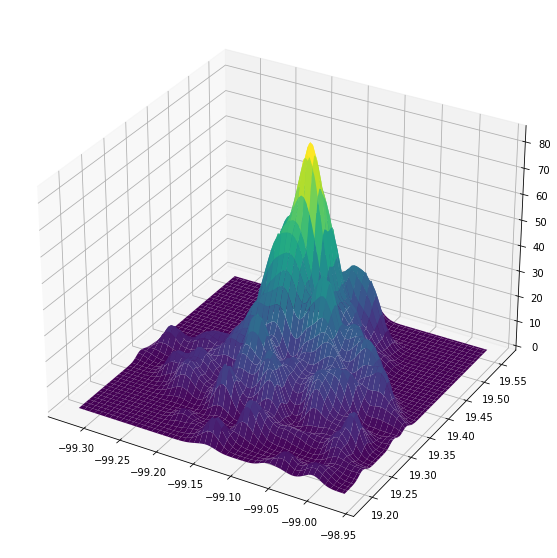

# criminologia_cdmx
> Herramientas para el análisis espacial de la delincuencia en la CDMX.


## Instalación

`pip install criminologia_cdmx`

## Uso

## ETL
````Python
from criminologia_cdmx.etl import *
````

### Bajar datos abiertos

Podemos bajar dos fuentes de datos: [carpetas de investigación](https://datos.cdmx.gob.mx/dataset/carpetas-de-investigacion-fgj-de-la-ciudad-de-mexico) y [víctimas en carpetas de investigación](https://datos.cdmx.gob.mx/dataset/victimas-en-carpetas-de-investigacion-fgj/resource/d543a7b1-f8cb-439f-8a5c-e56c5479eeb5).

Hay dos formas de bajar los datos abiertos, la primera es usando el api que baja las primeras `limit` carpetas/víctimas de la base abierta

```python
carpetas = get_carpetas_from_api(limit=100)
carpetas.head()
```


<div>
<style scoped>
    .dataframe tbody tr th:only-of-type {
        vertical-align: middle;
    }

    .dataframe tbody tr th {
        vertical-align: top;
    }

    .dataframe thead th {
        text-align: right;
    }
</style>
<table border="1" class="dataframe">
  <thead>
    <tr style="text-align: right;">
      <th></th>
      <th>_id</th>
      <th>ao_hechos</th>
      <th>mes_hechos</th>
      <th>fecha_hechos</th>
      <th>ao_inicio</th>
      <th>mes_inicio</th>
      <th>fecha_inicio</th>
      <th>delito</th>
      <th>fiscalia</th>
      <th>agencia</th>
      <th>...</th>
      <th>categoria_delito</th>
      <th>calle_hechos</th>
      <th>calle_hechos2</th>
      <th>colonia_hechos</th>
      <th>alcaldia_hechos</th>
      <th>competencia</th>
      <th>longitud</th>
      <th>latitud</th>
      <th>tempo</th>
      <th>geometry</th>
    </tr>
  </thead>
  <tbody>
    <tr>
      <th>0</th>
      <td>1039248</td>
      <td>2020</td>
      <td>Junio</td>
      <td>2020-06-21 22:00:00</td>
      <td>2020</td>
      <td>Julio</td>
      <td>2020-07-18T19:29:55</td>
      <td>ALLANAMIENTO DE MORADA, DESPACHO, OFICINA O ES...</td>
      <td>FISCALÍA DE INVESTIGACIÓN TERRITORIAL EN TLALPAN</td>
      <td>TLP-1</td>
      <td>...</td>
      <td>DELITO DE BAJO IMPACTO</td>
      <td>LA ESCONDIDA</td>
      <td>NaN</td>
      <td>SAN NICOLÁS 2</td>
      <td>TLALPAN</td>
      <td>NaN</td>
      <td>-99.2391510445674</td>
      <td>19.2695562888315</td>
      <td>NaN</td>
      <td>POINT (-99.23915 19.26956)</td>
    </tr>
    <tr>
      <th>1</th>
      <td>1039249</td>
      <td>2020</td>
      <td>Julio</td>
      <td>2020-07-18 12:00:00</td>
      <td>2020</td>
      <td>Julio</td>
      <td>2020-07-18T19:33:02</td>
      <td>AMENAZAS</td>
      <td>FISCALÍA DE INVESTIGACIÓN TERRITORIAL EN ALVAR...</td>
      <td>AO-4</td>
      <td>...</td>
      <td>DELITO DE BAJO IMPACTO</td>
      <td>AVENIDA TAMAULIPAS</td>
      <td>WICHITAS</td>
      <td>SANTA LUCIA</td>
      <td>ALVARO OBREGON</td>
      <td>NaN</td>
      <td>-99.2591274258199</td>
      <td>19.3568162329655</td>
      <td>NaN</td>
      <td>POINT (-99.25913 19.35682)</td>
    </tr>
    <tr>
      <th>2</th>
      <td>1039250</td>
      <td>2020</td>
      <td>Julio</td>
      <td>2020-07-18 19:15:00</td>
      <td>2020</td>
      <td>Julio</td>
      <td>2020-07-18T19:34:06</td>
      <td>NARCOMENUDEO POSESION SIMPLE</td>
      <td>FISCALÍA DE INVESTIGACIÓN TERRITORIAL EN IZTAP...</td>
      <td>IZP-8</td>
      <td>...</td>
      <td>DELITO DE BAJO IMPACTO</td>
      <td>AVENIDA DEL ARBOL</td>
      <td>FLOR DE EJIDO</td>
      <td>LOMAS DE SAN LORENZO</td>
      <td>IZTAPALAPA</td>
      <td>NaN</td>
      <td>-99.065551739753</td>
      <td>19.315777636718</td>
      <td>NaN</td>
      <td>POINT (-99.06555 19.31578)</td>
    </tr>
    <tr>
      <th>3</th>
      <td>1039251</td>
      <td>2020</td>
      <td>Julio</td>
      <td>2020-07-18 17:28:00</td>
      <td>2020</td>
      <td>Julio</td>
      <td>2020-07-18T19:37:23</td>
      <td>ENCUBRIMIENTO</td>
      <td>FISCALÍA DE INVESTIGACIÓN ESTRATÉGICA DEL DELI...</td>
      <td>ORIENTEII</td>
      <td>...</td>
      <td>DELITO DE BAJO IMPACTO</td>
      <td>AVENIDA 5 DE MAYO</td>
      <td>SE DEJA EN COLONIA NO SE ENCONTRO CALLE</td>
      <td>EJERCITO DE ORIENTE ZONA PEÑON</td>
      <td>IZTAPALAPA</td>
      <td>NaN</td>
      <td>-99.0261139000916</td>
      <td>19.3676830025799</td>
      <td>NaN</td>
      <td>POINT (-99.02611 19.36768)</td>
    </tr>
    <tr>
      <th>5</th>
      <td>1039253</td>
      <td>2020</td>
      <td>Julio</td>
      <td>2020-07-17 06:40:00</td>
      <td>2020</td>
      <td>Julio</td>
      <td>2020-07-18T19:43:05</td>
      <td>ROBO A TRANSEUNTE EN VIA PUBLICA SIN VIOLENCIA</td>
      <td>AGENCIA DE DENUNCIA DIGITAL</td>
      <td>CEN-1</td>
      <td>...</td>
      <td>ROBO A TRANSEUNTE EN VÍA PÚBLICA CON Y SIN VIO...</td>
      <td>AV SAN ANTONIO ABAD</td>
      <td>NaN</td>
      <td>ASTURIAS</td>
      <td>CUAUHTEMOC</td>
      <td>NaN</td>
      <td>-99.135937388168</td>
      <td>19.4035833346192</td>
      <td>NaN</td>
      <td>POINT (-99.13594 19.40358)</td>
    </tr>
  </tbody>
</table>
<p>5 rows × 21 columns</p>
</div>


```python
victimas = get_victimas_from_api(limit=100)
victimas.head()
```


<div>
<style scoped>
    .dataframe tbody tr th:only-of-type {
        vertical-align: middle;
    }

    .dataframe tbody tr th {
        vertical-align: top;
    }

    .dataframe thead th {
        text-align: right;
    }
</style>
<table border="1" class="dataframe">
  <thead>
    <tr style="text-align: right;">
      <th></th>
      <th>_id</th>
      <th>idCarpeta</th>
      <th>Ano_inicio</th>
      <th>Mes_inicio</th>
      <th>FechaInicio</th>
      <th>Delito</th>
      <th>Categoria</th>
      <th>Sexo</th>
      <th>Edad</th>
      <th>TipoPersona</th>
      <th>...</th>
      <th>FechaHecho</th>
      <th>HoraHecho</th>
      <th>HoraInicio</th>
      <th>AlcaldiaHechos</th>
      <th>ColoniaHechos</th>
      <th>Calle_hechos</th>
      <th>Calle_hechos2</th>
      <th>latitud</th>
      <th>longitud</th>
      <th>geometry</th>
    </tr>
  </thead>
  <tbody>
    <tr>
      <th>0</th>
      <td>1</td>
      <td>8324429</td>
      <td>2019</td>
      <td>Enero</td>
      <td>2019-04-01T00:00:00</td>
      <td>FRAUDE</td>
      <td>DELITO DE BAJO IMPACTO</td>
      <td>Masculino</td>
      <td>62</td>
      <td>FISICA</td>
      <td>...</td>
      <td>2018-08-29</td>
      <td>12:00:00</td>
      <td>12:19:00</td>
      <td>ALVARO OBREGON</td>
      <td>GUADALUPE INN</td>
      <td>INSUGENTES SUR</td>
      <td>NaN</td>
      <td>19.36125</td>
      <td>-99.18314</td>
      <td>POINT (-99.18314 19.36125)</td>
    </tr>
    <tr>
      <th>1</th>
      <td>2</td>
      <td>8324430</td>
      <td>2019</td>
      <td>Enero</td>
      <td>2019-04-01T00:00:00</td>
      <td>PRODUCCIÓN, IMPRESIÓN, ENAJENACIÓN, DISTRIBUCI...</td>
      <td>DELITO DE BAJO IMPACTO</td>
      <td>Femenino</td>
      <td>38</td>
      <td>FISICA</td>
      <td>...</td>
      <td>2018-12-15</td>
      <td>15:00:00</td>
      <td>12:20:00</td>
      <td>AZCAPOTZALCO</td>
      <td>VICTORIA DE LAS DEMOCRACIAS</td>
      <td>AV.  CUATLAHUAC</td>
      <td>NaN</td>
      <td>19.47181</td>
      <td>-99.16458</td>
      <td>POINT (-99.16458 19.47181)</td>
    </tr>
    <tr>
      <th>2</th>
      <td>3</td>
      <td>8324431</td>
      <td>2019</td>
      <td>Enero</td>
      <td>2019-04-01T00:00:00</td>
      <td>ROBO A TRANSEUNTE SALIENDO DEL BANCO CON VIOLE...</td>
      <td>ROBO A CUENTAHABIENTE SALIENDO DEL CAJERO CON ...</td>
      <td>Masculino</td>
      <td>42</td>
      <td>FISICA</td>
      <td>...</td>
      <td>2018-12-22</td>
      <td>15:30:00</td>
      <td>12:23:00</td>
      <td>COYOACAN</td>
      <td>COPILCO UNIVERSIDAD ISSSTE</td>
      <td>COPILCO</td>
      <td>NaN</td>
      <td>19.33797</td>
      <td>-99.18611</td>
      <td>POINT (-99.18611 19.33797)</td>
    </tr>
    <tr>
      <th>3</th>
      <td>4</td>
      <td>8324435</td>
      <td>2019</td>
      <td>Enero</td>
      <td>2019-04-01T00:00:00</td>
      <td>ROBO DE VEHICULO DE SERVICIO PARTICULAR SIN VI...</td>
      <td>ROBO DE VEHÍCULO CON Y SIN VIOLENCIA</td>
      <td>Masculino</td>
      <td>35</td>
      <td>FISICA</td>
      <td>...</td>
      <td>2019-04-01</td>
      <td>06:00:00</td>
      <td>12:27:00</td>
      <td>IZTACALCO</td>
      <td>AGRÍCOLA PANTITLAN</td>
      <td>CALLE 6</td>
      <td>ENTRE PRIVADA DEL VALLE Y PRIVADA GONZALEZ</td>
      <td>19.40327</td>
      <td>-99.05983</td>
      <td>POINT (-99.05983 19.40327)</td>
    </tr>
    <tr>
      <th>4</th>
      <td>5</td>
      <td>8324438</td>
      <td>2019</td>
      <td>Enero</td>
      <td>2019-04-01T00:00:00</td>
      <td>ROBO DE MOTOCICLETA SIN VIOLENCIA</td>
      <td>ROBO DE VEHÍCULO CON Y SIN VIOLENCIA</td>
      <td>Masculino</td>
      <td>NaN</td>
      <td>FISICA</td>
      <td>...</td>
      <td>2019-03-01</td>
      <td>20:00:00</td>
      <td>12:35:00</td>
      <td>IZTAPALAPA</td>
      <td>PROGRESISTA</td>
      <td>UNIVERSIDAD</td>
      <td>NaN</td>
      <td>19.3548</td>
      <td>-99.06324</td>
      <td>POINT (-99.06324 19.35480)</td>
    </tr>
  </tbody>
</table>
<p>5 rows × 24 columns</p>
</div>


La segunda es bajar el histórico completo:

````Python
carpetas_todas = get_historico_carpetas()
victimas_todas = get_historico_victimas()
````

También es posible procesar los datos a partir de un archivo guardado en la computadora, ya sea obtenido de la página de datos abiertos o guardado con las funciones `get_historico_carpetas`/`get_historico_victimas`.

````Python
carpetas = get_carpetas_desde_archivo("path-a-los-datos")
victimas_todas = get_victimas_desde_archivo("path-a-los-datos")
````

## Agregar identificadores espaciales (carpetas o victimas)

Para agregar los identificadores de colonia y cuadrante:

```python
carpetas = agrega_ids_espaciales(carpetas)
carpetas.head()
```


<div>
<style scoped>
    .dataframe tbody tr th:only-of-type {
        vertical-align: middle;
    }

    .dataframe tbody tr th {
        vertical-align: top;
    }

    .dataframe thead th {
        text-align: right;
    }
</style>
<table border="1" class="dataframe">
  <thead>
    <tr style="text-align: right;">
      <th></th>
      <th>_id</th>
      <th>ao_hechos</th>
      <th>mes_hechos</th>
      <th>fecha_hechos</th>
      <th>ao_inicio</th>
      <th>mes_inicio</th>
      <th>fecha_inicio</th>
      <th>delito</th>
      <th>fiscalia</th>
      <th>agencia</th>
      <th>...</th>
      <th>colonia_hechos</th>
      <th>alcaldia_hechos</th>
      <th>competencia</th>
      <th>longitud</th>
      <th>latitud</th>
      <th>tempo</th>
      <th>geometry</th>
      <th>colonia_cve</th>
      <th>colonia_nombre</th>
      <th>cuadrante_id</th>
    </tr>
  </thead>
  <tbody>
    <tr>
      <th>0</th>
      <td>1024416</td>
      <td>2020</td>
      <td>Junio</td>
      <td>2020-06-18 11:30:00</td>
      <td>2020</td>
      <td>Junio</td>
      <td>2020-06-18T15:41:11</td>
      <td>AMENAZAS</td>
      <td>FISCALÍA DE INVESTIGACIÓN TERRITORIAL EN BENIT...</td>
      <td>BJ-3</td>
      <td>...</td>
      <td>LETRÁN VALLE</td>
      <td>BENITO JUAREZ</td>
      <td>NaN</td>
      <td>-99.1615631604095</td>
      <td>19.3745426161242</td>
      <td>NaN</td>
      <td>POINT (-99.16156 19.37454)</td>
      <td>932</td>
      <td>LETRAN VALLE</td>
      <td>013</td>
    </tr>
    <tr>
      <th>25</th>
      <td>1024440</td>
      <td>2020</td>
      <td>Junio</td>
      <td>2020-06-18 16:00:00</td>
      <td>2020</td>
      <td>Junio</td>
      <td>2020-06-18T16:25:08</td>
      <td>ROBO A NEGOCIO SIN VIOLENCIA POR FARDEROS (TIE...</td>
      <td>FISCALÍA DE INVESTIGACIÓN TERRITORIAL EN BENIT...</td>
      <td>BJ-2</td>
      <td>...</td>
      <td>SANTA CRUZ ATOYAC</td>
      <td>BENITO JUAREZ</td>
      <td>NaN</td>
      <td>-99.1644768802292</td>
      <td>19.3708053008306</td>
      <td>NaN</td>
      <td>POINT (-99.16448 19.37081)</td>
      <td>927</td>
      <td>STA CRUZ ATOYAC</td>
      <td>013</td>
    </tr>
    <tr>
      <th>1</th>
      <td>1024417</td>
      <td>2020</td>
      <td>Junio</td>
      <td>2020-06-13 14:00:00</td>
      <td>2020</td>
      <td>Junio</td>
      <td>2020-06-18T15:42:35</td>
      <td>SUSTRACCIÓN DE MENORES</td>
      <td>FISCALÍA DE INVESTIGACIÓN TERRITORIAL EN IZTAC...</td>
      <td>IZC-2</td>
      <td>...</td>
      <td>GABRIEL RAMOS MILLÁN SECCIÓN TLACOTAL</td>
      <td>IZTACALCO</td>
      <td>NaN</td>
      <td>-99.105716711431</td>
      <td>19.3953360477985</td>
      <td>NaN</td>
      <td>POINT (-99.10572 19.39534)</td>
      <td>898</td>
      <td>TLACOTAL RAMOS MILLAN</td>
      <td>025</td>
    </tr>
    <tr>
      <th>2</th>
      <td>1024418</td>
      <td>2020</td>
      <td>Junio</td>
      <td>2020-06-18 14:40:00</td>
      <td>2020</td>
      <td>Junio</td>
      <td>2020-06-18T15:42:41</td>
      <td>ROBO A NEGOCIO CON VIOLENCIA</td>
      <td>FISCALÍA DE INVESTIGACIÓN TERRITORIAL EN IZTAP...</td>
      <td>IZP-6</td>
      <td>...</td>
      <td>LOMAS DE SAN LORENZO</td>
      <td>IZTAPALAPA</td>
      <td>NaN</td>
      <td>-99.0689250062205</td>
      <td>19.3157102852289</td>
      <td>NaN</td>
      <td>POINT (-99.06893 19.31571)</td>
      <td>389</td>
      <td>SAN LORENZO TEZONCO (PBLO)</td>
      <td>017</td>
    </tr>
    <tr>
      <th>3</th>
      <td>1024419</td>
      <td>2020</td>
      <td>Mayo</td>
      <td>2020-05-30 12:00:00</td>
      <td>2020</td>
      <td>Junio</td>
      <td>2020-06-18T15:45:31</td>
      <td>ROBO DE VEHICULO DE SERVICIO PARTICULAR SIN VI...</td>
      <td>FISCALÍA DE INVESTIGACIÓN TERRITORIAL EN IZTAP...</td>
      <td>IZP-5</td>
      <td>...</td>
      <td>SAN JUAN XALPA</td>
      <td>IZTAPALAPA</td>
      <td>NaN</td>
      <td>-99.0847959998612</td>
      <td>19.3354113029671</td>
      <td>NaN</td>
      <td>POINT (-99.08480 19.33541)</td>
      <td>1413</td>
      <td>SAN JUAN XALPA I</td>
      <td>013</td>
    </tr>
  </tbody>
</table>
<p>5 rows × 24 columns</p>
</div>


## Agregar categorías de usuario

Para clasificar las carpetas de investigación de acuerdo a una categorización definida por el usuario necesitamos un archivo que relacione la columna delitos de la base de carpetas con las categorías definidas por el usuario

```python
categorias = pd.read_csv("datos/categorias_carpetas.csv")
categorias
```


<div>
<style scoped>
    .dataframe tbody tr th:only-of-type {
        vertical-align: middle;
    }

    .dataframe tbody tr th {
        vertical-align: top;
    }

    .dataframe thead th {
        text-align: right;
    }
</style>
<table border="1" class="dataframe">
  <thead>
    <tr style="text-align: right;">
      <th></th>
      <th>incidente</th>
      <th>categoria</th>
    </tr>
  </thead>
  <tbody>
    <tr>
      <th>0</th>
      <td>HOMICIDIO POR AHORCAMIENTO</td>
      <td>Homicidios dolosos</td>
    </tr>
    <tr>
      <th>1</th>
      <td>HOMICIDIO POR ARMA BLANCA</td>
      <td>Homicidios dolosos</td>
    </tr>
    <tr>
      <th>2</th>
      <td>HOMICIDIO POR ARMA DE FUEGO</td>
      <td>Homicidios dolosos</td>
    </tr>
    <tr>
      <th>3</th>
      <td>HOMICIDIO POR GOLPES</td>
      <td>Homicidios dolosos</td>
    </tr>
    <tr>
      <th>4</th>
      <td>HOMICIDIOS INTENCIONALES (OTROS)</td>
      <td>Homicidios dolosos</td>
    </tr>
    <tr>
      <th>...</th>
      <td>...</td>
      <td>...</td>
    </tr>
    <tr>
      <th>73</th>
      <td>ROBO DE VEHICULO DE SERVICIO PÚBLICO CON VIOLE...</td>
      <td>Robo de/en vehículo</td>
    </tr>
    <tr>
      <th>74</th>
      <td>ROBO DE VEHICULO DE SERVICIO PÚBLICO SIN VIOLE...</td>
      <td>Robo de/en vehículo</td>
    </tr>
    <tr>
      <th>75</th>
      <td>ROBO DE VEHICULO ELECTRICO MOTOPATIN</td>
      <td>Robo de/en vehículo</td>
    </tr>
    <tr>
      <th>76</th>
      <td>OBO DE VEHICULO EN PENSION, TALLER Y AGENCIAS C/V</td>
      <td>Robo de/en vehículo</td>
    </tr>
    <tr>
      <th>77</th>
      <td>ROBO DE VEHICULO EN PENSION, TALLER Y AGENCIAS...</td>
      <td>Robo de/en vehículo</td>
    </tr>
  </tbody>
</table>
<p>78 rows × 2 columns</p>
</div>


Entonces podemos agregar las categorías a nuestra base

```python
carpetas = agregar_categorias_carpetas(carpetas)
carpetas[['delito', 'categoria']]
```


<div>
<style scoped>
    .dataframe tbody tr th:only-of-type {
        vertical-align: middle;
    }

    .dataframe tbody tr th {
        vertical-align: top;
    }

    .dataframe thead th {
        text-align: right;
    }
</style>
<table border="1" class="dataframe">
  <thead>
    <tr style="text-align: right;">
      <th></th>
      <th>delito</th>
      <th>categoria</th>
    </tr>
  </thead>
  <tbody>
    <tr>
      <th>0</th>
      <td>ALLANAMIENTO DE MORADA, DESPACHO, OFICINA O ES...</td>
      <td>NaN</td>
    </tr>
    <tr>
      <th>1</th>
      <td>AMENAZAS</td>
      <td>NaN</td>
    </tr>
    <tr>
      <th>2</th>
      <td>NARCOMENUDEO POSESION SIMPLE</td>
      <td>NaN</td>
    </tr>
    <tr>
      <th>3</th>
      <td>ENCUBRIMIENTO</td>
      <td>NaN</td>
    </tr>
    <tr>
      <th>4</th>
      <td>ROBO A TRANSEUNTE EN VIA PUBLICA SIN VIOLENCIA</td>
      <td>Robo a transeúnte</td>
    </tr>
    <tr>
      <th>...</th>
      <td>...</td>
      <td>...</td>
    </tr>
    <tr>
      <th>90</th>
      <td>VIOLENCIA FAMILIAR</td>
      <td>NaN</td>
    </tr>
    <tr>
      <th>91</th>
      <td>ROBO A NEGOCIO SIN VIOLENCIA</td>
      <td>Robo a negocio</td>
    </tr>
    <tr>
      <th>92</th>
      <td>ABUSO SEXUAL</td>
      <td>NaN</td>
    </tr>
    <tr>
      <th>93</th>
      <td>AMENAZAS</td>
      <td>NaN</td>
    </tr>
    <tr>
      <th>94</th>
      <td>ROBO A CASA HABITACION SIN VIOLENCIA</td>
      <td>Robo a casa habitación</td>
    </tr>
  </tbody>
</table>
<p>95 rows × 2 columns</p>
</div>


Algo similar se puede hacer para los datos de Víctimas, en este caso el archivo de categorías es un poco diferente

```python
categorias_victimas = pd.read_csv("datos/categorias_victimas.csv")
categorias_victimas
```


<div>
<style scoped>
    .dataframe tbody tr th:only-of-type {
        vertical-align: middle;
    }

    .dataframe tbody tr th {
        vertical-align: top;
    }

    .dataframe thead th {
        text-align: right;
    }
</style>
<table border="1" class="dataframe">
  <thead>
    <tr style="text-align: right;">
      <th></th>
      <th>Delito</th>
      <th>Categoria</th>
      <th>Cantidad</th>
      <th>Nivel 1</th>
      <th>Nivel 2</th>
      <th>Nivel 3</th>
    </tr>
  </thead>
  <tbody>
    <tr>
      <th>0</th>
      <td>ABORTO</td>
      <td>DELITO DE BAJO IMPACTO</td>
      <td>168</td>
      <td>NaN</td>
      <td>NaN</td>
      <td>NaN</td>
    </tr>
    <tr>
      <th>1</th>
      <td>ABUSO DE AUTORIDAD Y USO ILEGAL DE LA FUERZA P...</td>
      <td>DELITO DE BAJO IMPACTO</td>
      <td>5924</td>
      <td>NaN</td>
      <td>NaN</td>
      <td>NaN</td>
    </tr>
    <tr>
      <th>2</th>
      <td>ABUSO DE CONFIANZA</td>
      <td>DELITO DE BAJO IMPACTO</td>
      <td>12050</td>
      <td>Abuso de Confianza</td>
      <td>NaN</td>
      <td>NaN</td>
    </tr>
    <tr>
      <th>3</th>
      <td>ABUSO SEXUAL</td>
      <td>DELITO DE BAJO IMPACTO</td>
      <td>10238</td>
      <td>Abuso Sexual</td>
      <td>NaN</td>
      <td>NaN</td>
    </tr>
    <tr>
      <th>4</th>
      <td>ACOSO SEXUAL</td>
      <td>DELITO DE BAJO IMPACTO</td>
      <td>2986</td>
      <td>NaN</td>
      <td>NaN</td>
      <td>NaN</td>
    </tr>
    <tr>
      <th>...</th>
      <td>...</td>
      <td>...</td>
      <td>...</td>
      <td>...</td>
      <td>...</td>
      <td>...</td>
    </tr>
    <tr>
      <th>295</th>
      <td>VIOLACION TUMULTUARIA</td>
      <td>VIOLACIÓN</td>
      <td>74</td>
      <td>NaN</td>
      <td>NaN</td>
      <td>NaN</td>
    </tr>
    <tr>
      <th>296</th>
      <td>VIOLACION TUMULTUARIA EQUIPARADA</td>
      <td>VIOLACIÓN</td>
      <td>4</td>
      <td>NaN</td>
      <td>NaN</td>
      <td>NaN</td>
    </tr>
    <tr>
      <th>297</th>
      <td>VIOLACION TUMULTUARIA EQUIPARADA POR CONOCIDO</td>
      <td>VIOLACIÓN</td>
      <td>2</td>
      <td>NaN</td>
      <td>NaN</td>
      <td>NaN</td>
    </tr>
    <tr>
      <th>298</th>
      <td>VIOLACION Y ROBO DE VEHICULO</td>
      <td>VIOLACIÓN</td>
      <td>1</td>
      <td>NaN</td>
      <td>NaN</td>
      <td>NaN</td>
    </tr>
    <tr>
      <th>299</th>
      <td>VIOLENCIA FAMILIAR</td>
      <td>DELITO DE BAJO IMPACTO</td>
      <td>94592</td>
      <td>Violencia Familiar</td>
      <td>NaN</td>
      <td>NaN</td>
    </tr>
  </tbody>
</table>
<p>300 rows × 6 columns</p>
</div>


Las columnas importantes son `Nivel 1` y `Nivel 2` (podría haber más niveles), esas definen las categorías que se van a asignar a cada fila que se una a los datos de víctimas via la columna `Delito`

```python
victimas = agregar_categorias_victimas(victimas)
victimas[['Delito', 'Nivel 1', 'Nivel 2', 'Nivel 3']]
```


    ---------------------------------------------------------------------------

    NameError                                 Traceback (most recent call last)

    /tmp/ipykernel_20820/738531245.py in <module>
    ----> 1 victimas = agregar_categorias_victimas(victimas)
          2 victimas[['Delito', 'Nivel 1', 'Nivel 2', 'Nivel 3']]


    NameError: name 'agregar_categorias_victimas' is not defined


## Serie de tiempo por categoría

````Python
serie = serie_de_tiempo_categoria(carpetas_todas, pd.to_datetime('01/01/2016'), 'Robo a pasajero')
````

## Patrones espacio temporales

Este módulo tiene diferentes herramientas para explorar los patrones espacio-temporales de la actividad delictiva
````Python
from criminologia_cdmx.patrones_espacio_temporales import *
````

### Estimación de densidad de kernel
A partir de cualquier capa de incidentes se puede estimar el KDE utilizando validación cruzada para encontrar el mejor bandwidth

```python
carpetas = get_carpetas_from_api(1000)
x = carpetas.geometry.x.to_numpy()
y = carpetas.geometry.y.to_numpy()
params = {'bandwidth': np.linspace(0.001, 0.1, 100)}
bw = ajusta_bandwidth_kde(x, y, params)
xx, yy, zz = kde2D(x, y, bw, xbins=100j, ybins=100j)
fig = plt.figure(figsize=(10,10))
ax = plt.axes(projection='3d')
ax.plot_surface(xx, yy, zz,cmap='viridis', edgecolor='none')
```


    <mpl_toolkits.mplot3d.art3d.Poly3DCollection at 0x7fe3262c3c70>





### Serie de tiempo de KDEs por categoría

Para una categoría determinada se obtiene la serie de tiempo de densidades de Kernel para un periodo arbitrario, utilizando la agregación temporal determinada por el usuario.

Para usar esta función no es necesario agregar los ids de unidades espaciales

```python
carpetas = get_historico_carpetas()
carpetas = agregar_categorias_de_usuario(carpetas)
fechas = pd.date_range(start='1/1/2017', end='1/1/2020', freq='M').to_list()
xx, yy, kdes = serie_tiempo_kde_categoria(carpetas, fechas, ["Homicidios dolosos"], "30 days")
```

    /tmp/ipykernel_25308/253724238.py:1: DtypeWarning: Columns (15) have mixed types.Specify dtype option on import or set low_memory=False.
      carpetas = get_historico_carpetas()


A partir de esta serie de kdes es relatívamente fácil obtener una animación de la evolución:

```python
import matplotlib.animation as animation
def data(t):
    d = kdes[t]
    ax.clear()
    surf = ax.plot_surface(XX, YY, d[2], cmap='viridis', edgecolor='none', antialiased=False)
    ax.set_zlim([0,50]) # set zlim to be always the same for every frame


fig = plt.figure(figsize=(10,10))
ax = fig.gca(projection='3d')
surf = ax.plot_surface(xx, yy, kdes[0][2],cmap='viridis', edgecolor='none', antialiased=False)
ax.set_zlim(0, 50)
ani = animation.FuncAnimation(fig, data, len(kdes), interval=50, repeat=False )
plt.show()
```

    /tmp/ipykernel_25308/3416935710.py:10: MatplotlibDeprecationWarning: Calling gca() with keyword arguments was deprecated in Matplotlib 3.4. Starting two minor releases later, gca() will take no keyword arguments. The gca() function should only be used to get the current axes, or if no axes exist, create new axes with default keyword arguments. To create a new axes with non-default arguments, use plt.axes() or plt.subplot().
      ax = fig.gca(projection='3d')


```python
len(kdes)
```


    36


